# Guia prático dos comandos multiagente

**Edição 16 — agosto de 2026.** Esta edição preserva os 29 comandos públicos,
centraliza aliases e rotas em um manifesto executável e transforma o consenso
em camada decisória reutilizável por loops, perfil jurídico, councils e
workflows.

## Sobre esta edição

A reauditoria desta edição reforça o runtime com ledger global antirreplay,
estabilidade forte mínima de duas avaliações, vínculo exato entre recibo e
rodada, gates colegiados atestados, publicação concorrente sem perda de ledger
e checkpoints duráveis que não podem fabricar aprovação.

Também documenta o fluxo completo de produção independente, revisão
cruzada, debate e consolidação em ensembles N×N, além da formação de decisões
colegiadas em `seriatim`, `per_curiam` e `opinion_of_court`.

O conjunto foi empacotado como plugin portátil para Claude Cowork e Claude Code, com um
bridge auditável por pasta compartilhada para chamar as CLIs instaladas no Mac.

A edição acrescenta o contrato `legal_word_redline_v1`: versões limpas
canônicas e comparativos DOCX com alterações controladas nativas, incrementais
e acumuladas, produzidos localmente após as revisões do loop.

O motor formaliza até 20 versões completas por artefato, configuráveis caso a
caso, sem confundir esse limite com rodadas ou ciclos de debate.

A edição também acrescenta publicação controlada por revisores: candidatas paralelas para trabalho
simultâneo e, quando expressamente autorizado, publicação serializada da
próxima versão canônica contra o hash-base corrente.

Por fim, adota 30 minutos por chamada, até 60 minutos em exceção justificada,
limite total padrão de 3 horas e retomada por checkpoints. Sessões nativas são descartáveis por
padrão e persistem somente por opção explícita. O perfil opt-in
`durable_5d_v1` amplia somente o prazo total para até cinco dias corridos, sem criar uma chamada
monolítica nem alterar o padrão dos trabalhos comuns.

O manual passa a adotar projeto editorial em Lato, com títulos centralizados,
corpo justificado, entrelinha 1,5 e recuo de primeira linha; listas, tabelas e
blocos de comando conservam alinhamento próprio para preservar a legibilidade.

Este guia explica os 29 comandos de coordenação instalados para Claude Code,
Codex CLI, Gemini CLI, Antigravity, Kimi Code, OpenCode e Cursor CLI. O Grok é
acionado canonicamente pelo Cursor; a instalação no Grok CLI direto é mantida
apenas como compatibilidade legada. O objetivo é
mostrar não apenas a sintaxe, mas **qual comando escolher**, o que acontece em
cada etapa e o que o resultado realmente significa.

> Regra central: resposta, síntese, seleção e aprovação são estados diferentes.
> Um torneio pode escolher a melhor candidata sem aprová-la; um conselho pode
> recomendar uma solução sem produzir consenso; somente os gates configurados
> no loop podem declarar um artefato canônico aprovado.

## Sumário

1. Como usar em qualquer CLI
2. Mapa geral e escolha rápida
3. Conceitos essenciais
4. Comandos A2A Mesh
5. Conselhos, debates e consenso
6. Criação e aprovação de artefatos
7. Workflows formais
8. Histórico do Agent Council
9. Agentes nomeados no OpenCode
10. Receitas completas
11. Limites, falhas e solução de problemas
12. Referência rápida dos 29 comandos
13. Uso no Claude Cowork
14. Instalação única com NPM/NPX

### Índice visual dos fluxogramas

1. Mapa geral dos comandos
2. Árvore de escolha rápida
3. Critérios de apuração colegiada
4. Formação, votação e publicação colegiada
5. Streaming e execução durável
6. Modos do A2A Mesh
7. Consenso dentro do loop
8. Ensemble N×N
9. Ensemble profundo até o canônico aprovado
10. Redação jurídica consensual
11. Workflows formais
12. Histórico e retomada do Agent Council

## 1. Como usar em qualquer CLI

### 1.1 Forma mais simples

Abra o CLI dentro do projeto ou diretório que contém os arquivos e escreva o
comando na conversa:

```text
/council Devemos usar fila ou processamento síncrono para esta tarefa?
```

Os comandos aceitam linguagem natural. Você não precisa memorizar flags para os
fluxos mais completos:

```text
/loop-debate-agentes Claude redige a especificação, Codex critica e Gemini
audita. Faça até 4 rodadas por versão e 5 tentativas. Exija média 8,5, piso 7
e consenso estrito.
```

### 1.2 Onde os comandos estão disponíveis

Os mesmos 29 pontos de entrada foram sincronizados. Nos ambientes com diretório
de slash commands, eles aparecem como comandos; no Kimi Code, aparecem como
skills externas portáteis com o mesmo nome:

| Ambiente | Forma de uso |
|---|---|
| Claude Code | Digite `/nome-do-comando ...` no chat do Claude |
| Codex CLI | Digite `/nome-do-comando ...` no chat do Codex |
| Gemini CLI | Digite `/nome-do-comando ...`; o CLI também descobre as skills compartilhadas em `~/.agents/skills` |
| Antigravity | Peça em linguagem natural ou acione a skill compartilhada; `~/.agents/skills` é a superfície portátil |
| Kimi Code | Digite `/skill:nome-do-comando ...` ou peça em linguagem natural; não dependa de `/<nome>` para skills externas |
| Grok CLI direto | Compatibilidade legada: digite `/nome-do-comando ...`; para novas execuções de Grok, use Cursor CLI |
| OpenCode | Digite `/nome-do-comando ...`; use `@agente` para fixar identidades |
| Cursor CLI | Digite `/nome-do-comando ...` no modo de conversa do CLI |
| Claude Cowork | Instale o plugin e use `/multiagente-consensual:nome-do-comando ...` |

A instalação mantém duas superfícies complementares, sem prometer uma sintaxe
que o host não suporte. Os 29 arquivos de comando ficam sincronizados em
Codex, Claude Code, Cursor, OpenCode, Gemini CLI e, por compatibilidade, Grok
CLI direto. Os mesmos 29 nomes são descobertos como skills por Codex, Claude,
Cursor, OpenCode, Kimi Code e Antigravity por meio de `~/.agents/skills` e dos
links próprios de cada CLI.

Para reparar ou repetir a sincronização sem excluir extensões particulares:

```bash
python3 ~/plugins/multiagente-consensual/scripts/sync_cli_surface.py
```

O sincronizador é aditivo: não remove `/ask`, `/loop-portfolio` nem qualquer
outro comando ou skill criado fora da superfície pública do plugin.

O modelo que hospeda a conversa é o **host**. Quando você não escolhe um
redator, os loops usam o host como redator inicial por padrão. Assim, no Claude
o redator padrão é Claude; no Codex, Codex; e assim por diante.

No Cowork, o host é Claude. Outros modelos continuam sendo cadeiras reais: o
Cowork grava um pedido numa pasta compartilhada e o bridge do Mac o encaminha à
CLI correta. Criar o pedido não prova execução; somente o recibo correspondente,
com rota, modelo, código de saída e hashes, entra no ledger do fluxo.

### 1.3 Confirmação antes das chamadas externas

Os comandos de consenso, loop e workflow mostram uma prévia semelhante a esta:

```text
Entendi assim
Perfil-base: debate_agents_v1
Perfil de domínio: nenhum
Modo: artefato único
Estratégia: consenso estrito dentro do loop
Modo deliberativo: estrito
Política por tentativa: sempre
Formação colegiada: não ativa
Método de apuração: não aplicável
Redator: Claude
Crítico: Codex
Auditor: Gemini em sessão nova
Rodadas por versão: até 4
Tentativas: até 5
Meta média: 8,5
Piso por critério: 7,0
Saída: um canônico aprovado por artefato
```

Confira papéis, modelos, limites e permissões. A execução externa só começa
depois da sua confirmação. Se um modelo escolhido estiver indisponível, o fluxo
deve pausar; ele não pode trocar de modelo silenciosamente.

#### O que agora prova consenso

Um campo preenchido como `consenso: true` não basta. A aprovação forte exige o arquivo real dentro
de uma raiz explícita, hash recalculado, participantes canônicos, duas avaliações estáveis do mesmo
hash por padrão e um recibo HMAC do host para cada cadeira em cada avaliação. Cada recibo vincula
run, tentativa, rodada, nonce, rota, provedor, modelo, execução, entrada, saída e artefato. O ledger
global de nonces em `~/.agents/multiagent-state/nonces.json` é consumido atomicamente; reutilização
entre quaisquer runs falha como replay, inclusive em `--check-only`. A rodada do recibo deve
coincidir com o número da avaliação que o referencia. Uma rodada única recebe apenas estado
consultivo provisório e nunca usa `resultado = consenso`.
O consumo ocorre somente depois que evidências, modo, estado e demais regras passam. Um ledger
alternativo, seja por flag ou variável de ambiente, requer opt-in adicional explícito.

O gate colegiado com `consenso_estrito` incorpora o veredito completo do mesmo hash. Maioria,
unanimidade apenas no dispositivo, decisão de terceiro e booleanos declaratórios nunca passam como
consenso. A HMAC protege a integridade documental e o antirreplay; com shell irrestrito no mesmo
usuário, não substitui isolamento por conta, contêiner ou sandbox de sistema operacional.
Fora do consenso estrito, um gate colegiado forte exige ainda o arquivo real e um recibo HMAC por
voto. No método global, ele se vincula à opção; no analítico, ao vetor de respostas, às questões e
à tabela congelada; no híbrido, há um segundo recibo cujo hash cobre cadeira, booleano
`confirma`, eventual fundamento de divergência, dispositivo derivado e política de confirmação.
Alterar a confirmação sem novo ato assinado falha fechado. Sem essas provas, a apuração é apenas
`formation_only`.

### 1.4 Arquitetura simplificada, sem perda de comandos

Há quatro entradas conceituais principais:

| Entrada | Responsabilidade |
|---|---|
| `/consenso` | Deliberar e emitir `veredito_consenso_v1` sobre um hash congelado |
| `/loop-debate-agentes` | Produzir versões, receber críticas, corrigir e repetir os gates |
| `/redacao-juridica-consensual` | Aplicar ao loop o perfil jurídico, sem criar outro motor |
| `/workflow-agentes` | Organizar pipeline, DAG, swarm, map-reduce, torneio, votação e roteamento |

Nenhum dos 29 nomes foi removido. Os demais comandos são aliases, perfis de
domínio ou adaptadores externos preservados:

| Família preservada | Entrada comum | Efeito |
|---|---|---|
| `/pipeline-agentes`, `/dag-agentes`, `/swarm-agentes`, `/map-reduce-agentes`, `/torneio-agentes`, `/votacao-agentes`, `/roteamento-adaptativo` | `/workflow-agentes` | Seleciona o protocolo correspondente |
| `/council`, `/council-high`, `/llm-council` | `/consenso` | Executa um perfil consultivo de deliberação |
| `/multi-debate`, `/pal-council`, `/sage-debate` | `/consenso` | Usa o MCP específico como perfil externo consultivo |
| comandos A2A | workflow, consenso ou loop conforme o perfil | Mantém a execução do mesh sem herdar aprovação automática |

O contrato central fica em `~/.agents/multiagent-manifest.json`. Ele separa:

- **seat:** o modelo ou identidade solicitada;
- **route:** o CLI realmente usado;
- **profile:** a estratégia ativada pelo nome do comando;
- **approval ceiling:** o maior poder decisório daquela integração.

As rotas obrigatórias são Claude pelo Claude Code, Grok pelo Cursor no modelo
fixo `cursor-grok-4.6-high`, Kimi K3 pelo Kimi Code e Gemini 3.7 Flash High
pelo Antigravity.

Para novas chamadas, outro modelo Grok é rejeitado; runs históricos já congelados preservam o modelo
registrado. `model-routing.yaml` continua existindo apenas como visão de
compatibilidade gerada. Manifesto ausente ou divergente causa pausa, nunca
fallback silencioso.

Councils e MCPs sem prova de sessão/modelo permanecem consultivos. Uma cadeira
simulada pode demonstrar o fluxo, mas retorna `verdict: null` e não participa de
quórum. Seleção, votação e torneio retornam `aprovacao: false`; a candidata só
avança quando passa pelos gates configurados.

## 2. Mapa geral e escolha rápida

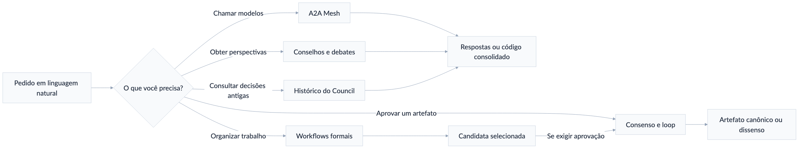

*Figura 1 — Mapa geral dos comandos e das famílias de coordenação.*

### Qual comando escolher?

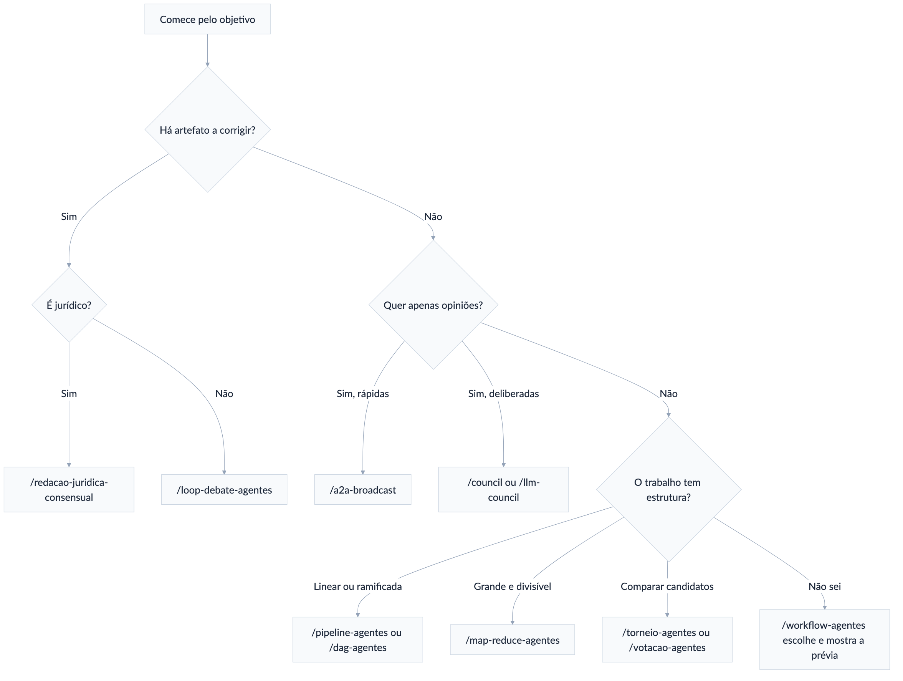

*Figura 2 — Árvore de escolha do comando conforme a finalidade do trabalho.*

| Necessidade | Comece com |
|---|---|
| Fazer uma pergunta a um único agente do mesh | `/a2a-call` |
| Comparar até oito respostas rápidas | `/a2a-broadcast` |
| Dar papéis diferentes a Codex, Claude, Gemini e Grok | `/a2a-team` |
| Debater um tema sem produzir versões sucessivas | `/a2a-debate` ou `/council` |
| Conselho multimodelo com crítica adversarial | `/llm-council` |
| Obter consenso verificável sobre arquivos ou decisão | `/consenso` |
| Redigir, criticar, corrigir e repetir | `/loop-debate-agentes` |
| Produzir parecer ou minuta judicial com gates jurídicos | `/redacao-juridica-consensual` |
| Deixar o sistema escolher um protocolo de trabalho | `/workflow-agentes` |
| Trabalho linear A → B → C | `/pipeline-agentes` |
| Tarefas ramificadas e paralelas | `/dag-agentes` |
| Grande corpus divisível | `/map-reduce-agentes` |
| Equipe exploratória com composição variável | `/swarm-agentes` |
| Escolher entre artefatos por confrontos | `/torneio-agentes` |
| Agregar preferências | `/votacao-agentes` |
| Escolher modelos conforme qualidade, custo e latência | `/roteamento-adaptativo` |

## 3. Conceitos essenciais

### 3.1 Estratégia da equipe e ciclo de melhoria

São controles independentes:

| Controle | Pergunta que responde | Exemplos |
|---|---|---|
| `estrategia_da_equipe` | Como os agentes colaboram sobre a mesma versão? | sem debate, debate, consenso, supervisor |
| `ciclo_de_melhoria` | Quando criar outra versão e repetir a avaliação? | revisão única, até critérios, até limite |

Por isso são possíveis quatro combinações:

- **Debate sem loop:** agentes discutem uma vez e entregam uma conclusão.
- **Loop sem debate:** um redator escreve, um avaliador verifica e o responsável
  corrige sucessivamente.
- **Debate dentro do loop:** cada versão passa por debate antes da avaliação.
- **Consenso dentro do loop:** cada nova versão invalida o consenso anterior e
  delibera novamente conforme a frequência configurada, além das notas e da
  auditoria.

### 3.2 Motor-base e perfil de domínio

O `/loop-debate-agentes` é a fonte única da mecânica de versões: papéis,
tentativas, hashes, candidatos, canônicos, painel, independência, auditoria e
parada. O manifesto central governa seats, rotas e aliases; `$consenso` governa
a semântica decisória pelo contrato `veredito_consenso_v1`.

Uma skill especializada pode aplicar um **perfil de domínio**, mas não cria um
segundo motor. O perfil acrescenta briefing, fontes, estrutura, rubrica e gates
próprios. Atualmente, `/redacao-juridica-consensual` usa:

```text
perfil_base: debate_agents_v1
perfil_dominio: juridico_consensual_v2
```

Em conflito, o motor governa a mecânica e prevalece o requisito de aprovação
mais restritivo. Runs antigos já congelados não são reescritos.

### 3.3 Rodada, ciclo e tentativa

| Unidade | Significado |
|---|---|
| Rodada | Uma fase coordenada sobre a mesma versão; vários agentes podem responder em paralelo |
| Ciclo de debate | Crítica → réplica → revisão; consome ao menos 3 rodadas |
| Tentativa de melhoria | Uma versão congelada, seu debate e sua avaliação externa |

Em runs novos, tentativa e versão canônica avançam juntas: a primeira minuta é
`v1`/tentativa 1 e cada correção substantiva cria a seguinte. O padrão é 6 e o
usuário pode configurar de 1 a 20 versões completas por `artefato_id`.

A execução para cedo quando os gates fecham; `v20` é a última e `v21` não é
gerada. Pareceres, patches, redlines e candidatas não promovidas não contam.
Uma seleção, síntese ou edição manual só conta quando entra na cadeia canônica.

Exemplo com 4 rodadas e 3 tentativas:

```text
Tentativa 1: versão 1 → até 4 rodadas → reprovada
Tentativa 2: versão 2 → até 4 rodadas → reprovada
Tentativa 3: versão 3 → até 4 rodadas → aprovada ou encerrada
```

Os limites-padrão do consenso são 8 rodadas globais e 2 ciclos completos por
tentativa. Cada rodada é uma fase coordenada e pode colher respostas paralelas
de vários participantes. Cada cadeira tem uma crítica, uma réplica e uma
revisão por ciclo confirmado.

A faixa operacional recomendada vai até 18
rodadas globais e 6 ciclos.

Se ainda houver bloqueio material e progresso mensurável, o motor pode estender
automaticamente 3 rodadas e 1 ciclo por vez, até o teto excepcional de 36
rodadas globais e 12 ciclos. Após dois ciclos sem progresso, a execução para e
informa os pontos de dissenso.

### 3.4 Consenso: modo e frequência

São duas escolhas separadas. O **modo** define o efeito da deliberação:

| Modo | Efeito na aprovação |
|---|---|
| `estrito` | O mesmo hash precisa de consenso estável |
| `com_decisor` | Busca consenso; um decisor pode resolver matérias julgáveis, sempre com o rótulo `decisão final sem consenso` |
| `consultivo` | Registra recomendações e dissensos, sem gate deliberativo vinculante |
| `desativado` | Não delibera nem alega consenso |

A **frequência** define quando deliberar:

| Política | Comportamento | Quando usar |
|---|---|---|
| `sempre` | Repete o debate completo sobre cada novo hash | Documentos sensíveis ou consenso obrigatório |
| `se_necessario` | Reabre diante de mudança material, bloqueador ou pedido do painel | Bom equilíbrio entre rigor e custo |
| `apenas_primeira` | Debate somente a primeira versão; as seguintes passam por avaliação e correção | Quando o enquadramento é o ponto mais controverso |
| `nenhum` | Não há debate; somente redação, avaliação e correção | Tarefas objetivas e de baixo risco |

Use `desativado + nenhum` em conjunto. Os demais modos combinam com `sempre`,
`se_necessario` ou `apenas_primeira`.

Para aprovação expressamente pedida em
consenso, o motor usa `estrito + sempre`. Em melhoria iterativa comum sem pedido
de consenso, a prévia pode propor `consultivo + se_necessario`. O perfil
jurídico usa `estrito + sempre` como default, mas permite outra configuração.

Maioria, parecer consultivo e decisão de supervisor nunca devem ser chamados de
consenso.

### 3.5 Formação da decisão colegiada

Há um terceiro eixo independente da estratégia, do loop e do consenso:
`formacao_decisao_colegiada`. Ele explica como votos finais se convertem em
resultado, fundamentos comuns e documentos publicáveis. Só é ativado quando o
pedido envolver colegiado, acórdão, votos ou uma modalidade expressa.

| Modalidade | Como decide e publica | Saída principal |
|---|---|---|
| `seriatim` | Cada cadeira profere voto próprio; resultado e fundamentos são agregados depois | certidão, votos individuais e mapa de adesões |
| `per_curiam` | O colegiado publica texto institucional impessoal | opinião única, com dissensos preservados e publicados conforme a política |
| `opinion_of_court` | Uma coalizão majoritária adere à opinião principal | opinião da maioria, votos concorrentes e votos dissidentes |

Modalidade e critério de apuração são escolhas diferentes. A modalidade define
como o colegiado fala; o critério define **o que cada cadeira vota**:

| Critério | Objeto do voto | Contrato | Resultado |
|---|---|---|---|
| `global` (*case-by-case*) | dispositivo final do caso | `decisao_colegiada_v1` | placar direto por opção |
| `analitico` (*issue-by-issue*) | cada questão ou premissa | `decisao_colegiada_v2` | dispositivo derivado por regra congelada |
| `hibrido` | questões e, depois, confirmação do derivado | `decisao_colegiada_v2` | só proclama após confirmação bloqueante |

`global` continua sendo o padrão. O sistema só ativa `analitico` ou `hibrido`
quando você pedir expressamente votação por questões ou confirmação do resultado
derivado. Dizer apenas “acórdão” ou “vote as preliminares em separado” não muda o
critério silenciosamente.

A regra de resultado é configurada à parte: unanimidade, maioria simples,
maioria qualificada, consenso estrito ou decisão de terceiro. O placar responde
**quem venceu**; a matriz de adesões responde **quais proposições formam a
ratio**.

Cada fundamento essencial recebe um ID e cada cadeira registra sua
adesão. Só há `ratio_status = unificada` quando o apoio exigido recai sobre ao
menos uma proposição essencial que integra a opinião principal.

```text
Dispositivo: 2 × 1 pela procedência
P1 — competência do órgão: Claude ✓  Codex ✓  Grok ✗
P2 — incidência da norma:   Claude ✓  Codex ✓  Grok ✗
P3 — fundamento alternativo: Claude ✗ Codex ✗ Grok ✓

Resultado: decisão por maioria
Ratio comum: P1 + P2
Dissidência: P3, preservada em voto separado
Consenso: não
```

Se a maioria concordar apenas no dispositivo, o recibo declara
`ratio_status = somente_resultado`. Quando `ratio_exigida = true`, isso reprova
o gate e devolve a matéria ao loop.

No critério analítico, o sistema também compara o resultado das maiorias por
questão com os pacotes individuais. Isso detecta a maioria cruzada:

```text
Cadeira A: P = sim, Q = não  → dispositivo B
Cadeira B: P = não, Q = sim  → dispositivo B
Cadeira C: P = sim, Q = sim  → dispositivo A

Maioria em P: sim
Maioria em Q: sim
Dispositivo derivado de P ∧ Q: A
Cadeiras que chegariam individualmente a A: 1 de 3

Resultado: A por derivação das questões
Paradoxo doutrinário: sim
Ratio comum do pacote: não
```

O recibo mostra `dispositivo_derivado`, `dispositivo_por_cadeira`, coalizões por
questão e `paradoxo_doutrinario`. Sem maioria aderente ao pacote, ele não escreve
“a maioria decidiu A”. No híbrido, a confirmação pode impedir a proclamação e
devolver o caso ao loop, mas nunca transforma maioria em consenso.

O sistema não inventa um fundamento comum.
Qualquer alteração do artefato, da opinião principal ou de uma proposição
essencial cria novo hash e exige nova votação.

Essas modalidades podem ser combinadas com ensemble, Borda, Condorcet ou
Delphi, mas não se confundem.

A votação escolhe ou ordena candidatas; a formação
colegiada apura votos jurídicos, ratio e opiniões separadas sobre a candidata
selecionada.

A decisão colegiada formada ainda é intermediária: painel, fontes,
consenso quando exigido e auditoria continuam necessários.

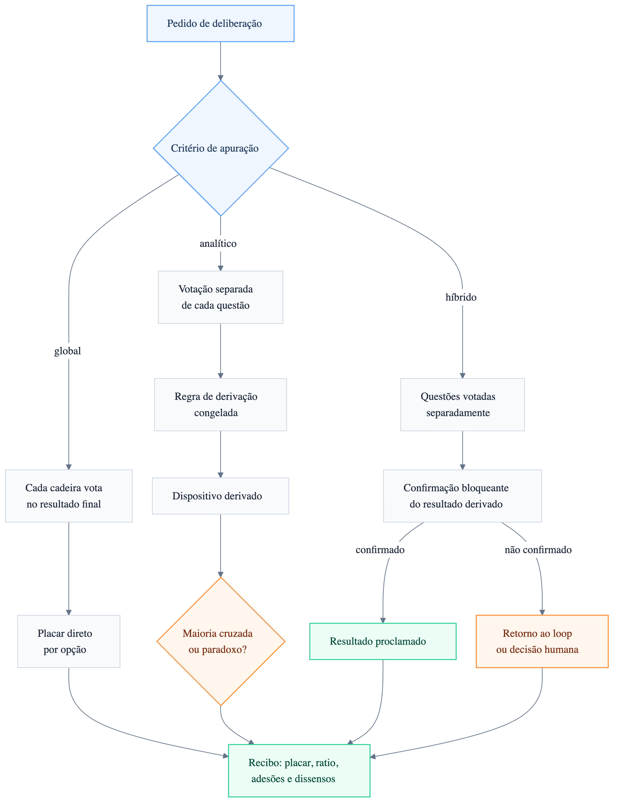

*Figura 3 — Critérios global, analítico e híbrido para apuração colegiada.*

### 3.6 Hash, candidata, canônico e pacote

- **Hash:** impressão digital da versão exata do arquivo.
- **Candidata:** artefato que pode ser comparado ou avaliado.
- **Candidata selecionada:** venceu votação, torneio ou decisão de juiz.
- **Canônico aprovado:** passou no gate deliberativo efetivo, na meta, no piso e
  na auditoria cega, todos sobre o mesmo hash.
- **Pacote:** conjunto de artefatos autônomos, cada um com seu próprio hash,
  ledger, candidatos, gates e exatamente um canônico aprovado.

Qualquer alteração cria novo hash e invalida a aprovação anterior daquele
artefato. Em pacote, o manifesto conjunto também é invalidado; somente o item
alterado e os dependentes materialmente afetados são reabertos.

### 3.7 Independência real

Identidade, papel, sessão, modelo e provedor são campos diferentes. Duas
identidades que usam o mesmo modelo representam sessões distintas, mas não
diversidade de modelo. Uma auditoria cega recebe somente o artefato final, as
fontes e a rubrica; não recebe notas, críticas ou versões anteriores.

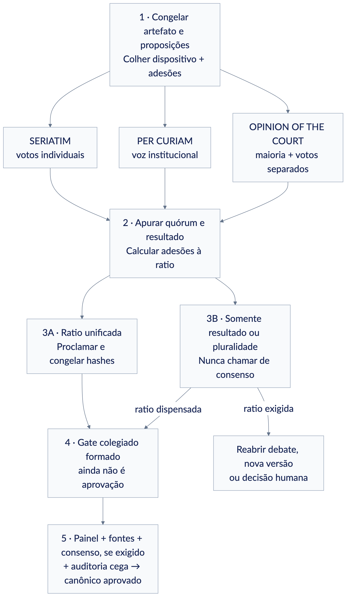

*Figura 4 — Formação, votação e publicação de uma decisão colegiada.*

<!-- pagebreak -->

### 3.8 Acesso integral a arquivos e autoria

Todas as cadeiras executadas por Claude Code, Codex, Gemini/Antigravity,
Cursor/Grok, Kimi Code e OpenCode recebem ferramentas técnicas completas: podem ler, criar,
alterar e excluir arquivos sob a identidade da conta. O projeto é sempre explícito; diretórios
adicionais são concedidos caso a caso e a pasta pessoal nunca é incluída silenciosamente. Como as
CLIs usam shell irrestrito sob o mesmo usuário, esses escopos são governança auditável, não sandbox
do sistema operacional nem proteção contra um agente malicioso da própria conta.

Essa capacidade não altera sozinha a governança do documento. O padrão é
`parecer_apenas`: somente o redator ou consolidador resolvido publica a próxima
versão canônica. O usuário também pode autorizar revisores por dois modos:

- `publicar_candidata`: cada revisor publica uma versão própria, branch ou
  worktree, sem trocar o ponteiro canônico;
- `publicar_canonico`: ativa `publicacao_compartilhada`; um revisor nomeado e
  com o turno congelado publica diretamente a próxima versão canônica, sem o
  redator precisar reapresentá-la.

No segundo modo, `base_sha256` precisa coincidir com o canônico real e o candidato também precisa
existir no root explícito com o hash declarado. O runtime usa lock exclusivo, estágio no mesmo
filesystem, `fsync`, troca atômica, verificação final, chave idempotente e recibo atestado. Caminho
inexistente, symlink, base obsoleta ou replay conflitante falha fechado. A publicação cria rascunho,
não aprovação: novo hash reinicia consenso, avaliação e auditoria.

O publicador não conta como avaliador ou
auditor independente da própria versão. Para trabalho simultâneo, prefira
candidatas separadas e integração posterior; não permita vários agentes
sobrescreverem o mesmo canônico.

### 3.9 Saída adaptativa até o máximo nativo

Todos os comandos herdam `adaptive_output_v1`. O padrão
`adaptive_up_to_native_max` significa duas coisas simultâneas:

- o agente deve parar assim que a resposta estiver completa; não há obrigação de
  preencher a janela;
- se a tarefa precisar, o agente pode usar até o teto efetivo de saída que o
  modelo, o provedor e a CLI disponibilizarem naquela chamada.

Não existe um `max_output_tokens` global inferior aos modelos. A janela de
contexto também não é tratada como se fosse toda saída: ela inclui entrada,
instruções, ferramentas e resposta.

Como Claude Code, Codex, Cursor, Kimi Code,
OpenCode e Antigravity não oferecem uma flag uniforme de máximo de saída, o
recibo registra `native_route_ceiling` quando esse for o controle real, sem
inventar um número de tokens.

Os motores externos seguem a mesma regra. `multi-debate` não aplica mais o
antigo teto genérico de 32 mil tokens.

O `/llm-council` não reduz automaticamente
rascunho, crítica e síntese para 4 mil/2 mil/8 mil; `pal-council` não atribui
32 mil a modelos desconhecidos do OpenRouter; e `sage-debate` usa um limite
específico do modelo configurado. O modo limitado continua disponível quando
for solicitado explicitamente.

Metas curtas de conselhos e rodadas são orientações de concisão, não cortes
duros. Um limite menor informado pelo usuário continua prevalecendo.

Se um documento ou arquivo obrigatório não couber em uma resposta, a mesma cadeira
continua por segmentos, preferencialmente na mesma sessão, até oito segmentos
por padrão.

Só depois da verificação de completude o artefato recebe hash final,
nota, consenso ou aprovação. A continuação técnica não conta como nova rodada;
uma alteração material no texto já concluído conta como nova versão.

### 3.10 Sessões nativas, timeout e retomada

O histórico canônico dos fluxos fica em `~/.agents/runs` e, no Cowork, também
nos recibos do `outbox`. Em runs novos e legados, a persistência nativa é
desativada por padrão. Cada chamada continua sendo uma execução isolada; uma sessão recuperável na
CLI de origem só é solicitada quando o usuário ativa o espelho. A sessão nativa nunca é a fonte
canônica do run.

Para desativar os espelhos, diga em linguagem natural:

```text
Não salve sessões nas respectivas CLIs; use chamadas descartáveis.
```

Isso confirma `persistir_sessoes_nativas: false`. Para ativar, diga “salve também as sessões nas
respectivas CLIs”. Redator, críticos, painel e auditoria continuam com execuções ou sessões
independentes.

O recibo
registra se a persistência foi solicitada, efetivada e confirmada, além do id ou
título recuperável quando a CLI o expõe. A cópia nativa é somente um espelho:
não substitui o ledger, os hashes, o artefato canônico nem o veredito.
O identificador enviado à CLI aparece como `session_requested_id`; só vira
`session_id` confirmado se a própria CLI o devolver em saída estruturada ou
consulta posterior. Correlação solicitada nunca é tratada como observação.
Campos aninhados dentro do texto do agente também não confirmam modelo ou sessão: somente o envelope
estruturado e os mapas de uso definidos pela CLI são probatórios.

Cada chamada tem timeout padrão de 30 minutos. A faixa comum vai de 30 segundos
a 30 minutos; tarefas pesadas podem usar até 60 minutos mediante justificativa.

O loop completo usa limite operacional padrão de 3 horas e pode ser configurado
até 6 horas na faixa recomendada. Trabalhos maiores devem ser divididos em
checkpoints: salvar artefato, estado, hashes e recibos e retomar a mesma cadeira
na sessão confirmada. Timeout nunca equivale a aprovação.

Em uma chamada direta do host:

```bash
multiagent-bridge invoke \
  --participant claude \
  --root /caminho/do/caso \
  --prompt-file /caminho/do/caso/prompt.md \
  --persist-native-session
```

Se a CLI responder mas não fornecer prova recuperável da sessão, o texto
continua preservado no histórico central e o espelho aparece como “não
confirmado”; o sistema não declara sucesso silenciosamente.

### 3.11 Execução durável por até cinco dias

Use `durable_5d_v1` quando o trabalho realmente precisar atravessar dias, reinícios ou períodos de
indisponibilidade. O prazo máximo é de 432000 segundos contados desde o início. O Mac não trabalha
enquanto dorme, está desligado ou sem acesso às CLIs, mas esse intervalo consome o prazo corrido.

O coordenador grava `checkpoint.json` atomicamente depois de cada chamada e das fronteiras
aplicáveis — rodada, ciclo, versão, nó, onda e join. Cada unidade recebe `event_id`, hash de entrada e
hash de saída. Após reinício, `status` e `resume` retomam somente o que ainda não foi registrado; uma
repetição com o mesmo evento, entrada, saída e estado é reconhecida como duplicata. A mesma chave
com saída ou estado divergente é conflito. `max_segundos` é obrigatório no perfil ativo, e o
checkpoint só aceita estados operacionais: `aprovado` pertence aos gates externos.
`--now` é exclusivo de testes e exige `--allow-test-clock`; produção usa o relógio do host. O lock
é 0600 e o ledger de eventos possui teto vinculado ao orçamento total de chamadas.

Pedido recomendado:

```text
/workflow-agentes execute este trabalho com o perfil durável por até cinco dias corridos. Mantenha
30 minutos por chamada e até 60 minutos apenas quando justificado. Salve checkpoint após cada
chamada, nó, onda, join, rodada, ciclo e versão. Retome do último checkpoint após reinício, sem
substituir modelos ou CLIs. Congele limites diários e totais de chamadas e custo. Pare antes por
aprovação, cancelamento, bloqueio, orçamento ou dois ciclos sem progresso e informe qualquer
dissenso ou etapa incompleta.
```

No `loop-debate-agentes`, o mesmo pedido preserva os limites de rodadas, ciclos e até 20 versões por
artefato. O deadline nunca vale como consenso ou aprovação. Um bridge/coordenador ativo pode
continuar automaticamente; sem processo ativo, o run fica apenas persistido e retomável.

Exemplos naturais:

```text
/loop-debate-agentes redija o documento completo; use saída adaptativa até o máximo do modelo e continue se necessário

/consenso seja conciso nas críticas, mas não trunque nenhum bloqueador material

/workflow-agentes permita respostas até o teto nativo; não obrigue os agentes a usar todo o limite
```

## 4. Comandos A2A Mesh

O A2A Mesh é o caminho mais direto entre oito peers: Codex, Claude, Gemini,
Grok 4.6 High, GLM 5.3, DeepSeek V4 Pro, Kimi K3 e Qwen 3.8 Max. O Grok usa
exclusivamente o Cursor CLI na porta 3144; GLM, DeepSeek e Qwen usam o OpenCode Go
nas portas 3145, 3146 e 3148, com variante `max`; Kimi usa exclusivamente o Kimi
Code na porta 3147.
Os modelos são fixos e não há fallback silencioso.

No painel, a faixa **Equipe** permite ligar e desligar cadeiras antes do envio.
A seleção fica persistida no navegador e vale para broadcast, consenso, ensemble,
debate e team. O botão **Todos** restaura as oito cadeiras; a opção textual
`--agents=claude,codex,qwen` substitui a seleção apenas na execução atual.

Todos os trabalhos A2A são submetidos de forma durável. A resposta inicial é um recibo com
`task_id`; o servidor prossegue independentemente da janela MCP ou do navegador. As skills aguardam
o mesmo ID por blocos de até 240 segundos e repetem a consulta, sem reenviar o prompt. Para controle
manual, use as tools MCP `a2a_task_status`, `a2a_task_wait` e `a2a_task_cancel`.

O painel mostra em tempo real os deltas textuais efetivamente produzidos pelas CLIs, além de agente,
fase e estado. Isso não inclui raciocínio interno oculto. Os deltas trafegam ao vivo sem ocupar o
ledger append-only; o schema v4 atualiza um checkpoint substituível por tarefa e agente. Eventos de
fase, argumentos, síntese e estado recebem IDs persistidos; uma
reconexão busca tudo o que ocorreu desde o último ID. Se a conexão com um peer cair, o coordenador
consulta a tarefa remota já criada em vez de abrir outra sessão. Em falha, a saída parcial
recuperável é preservada como `partial-output.md`, combinando o checkpoint exato mais novo de cada
agente com o diálogo cronológico legado das demais cadeiras. Tokens repetidos legítimos são
preservados sem duplicar a resposta final sobre os próprios deltas.

O cartão de cada tarefa apresenta um stepper coerente com a operação. No ensemble, por exemplo,
as etapas são `Geração → Revisão cruzada → Revisão → Síntese → Resultado`; consenso,
debate, equipe e plano possuem sequências próprias. A faixa de observabilidade exibe tempo total,
TTFT, tokens, custo, duração das etapas e latência de cancelamento quando o runtime fornece esses
dados. Um travessão indica dado indisponível, nunca uma estimativa inventada.

O `request_id` fica no ledger SQLite compartilhado e impede duplicação entre coordenadores ou após
reinício. Cancelamento explícito propaga para a tarefa remota conhecida; queda de streaming não
equivale a cancelamento. Estados terminais usam compare-and-set, de modo que uma conclusão tardia
não substitui `canceled` ou `failed`. O replay é paginado; uma lacuna acima do teto defensivo gera
`mesh-gap`, e o painel busca as páginas restantes sem truncamento silencioso. **Clear** define um
corte temporal persistente, evitando que mensagens antigas reapareçam na reconexão.
Se uma tarefa ultrapassar o teto defensivo de eventos, o ledger grava `mesh_gap`, suprime apenas
eventos intermediários excedentes e continua aceitando o evento terminal. Como tokens ao vivo usam
checkpoints substituíveis, eles não conseguem consumir o orçamento antes da síntese.

Quando a chamada MCP omite `request_id`, o bridge deriva uma chave estável do conteúdo numa janela
deslizante padrão de 60 segundos e somente dentro da sessão daquele processo MCP. Assim, uma
repetição imediata do host recupera a mesma tarefa sem confundir clientes independentes nem sofrer
com fronteiras fixas de tempo. Para repetir de propósito nessa janela, informe um `request_id`
novo; para deduplicar depois de reiniciar o bridge, forneça um `request_id` explícito.

O timeout padrão por chamada de modelo é 30 minutos. A orquestração completa tem 24 horas por padrão
e aceita até cinco dias (`operation_timeout_ms: 432000000`) quando o caso exigir. Encerrar uma espera
ou fechar o painel não cancela a tarefa.

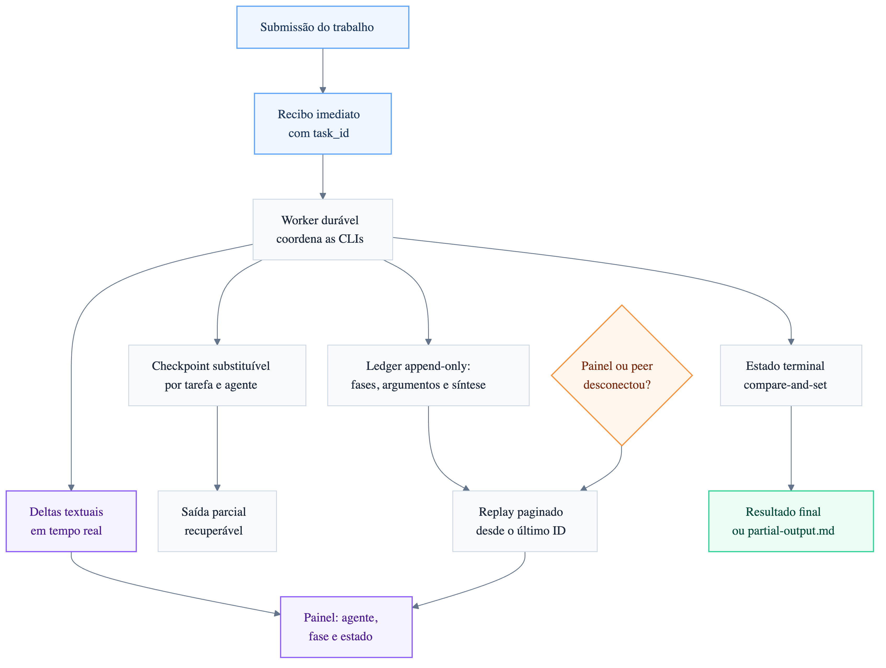

*Figura 5 — Separação entre streaming ao vivo, ledger durável, replay e recuperação.*

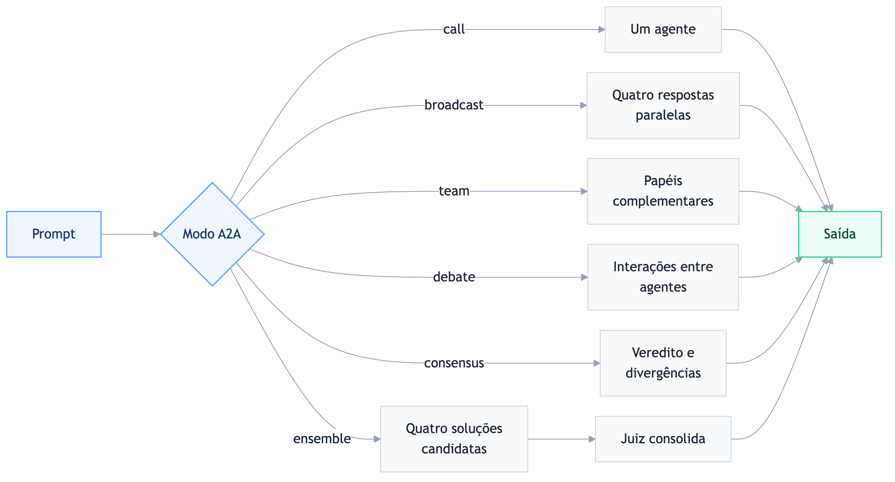

*Figura 6 — Modos de convocação e colaboração disponíveis no A2A Mesh.*

### 4.1 `/a2a-status`

**Serve para:** verificar quais dos oito backends estão ativos antes de um trabalho.

```text
/a2a-status
```

Mostra agente, porta, modelo, modo CLI/API, tarefas ativas e estado `ok` ou
`down`. Use primeiro quando uma chamada A2A falhar ou parecer travada.

### 4.2 `/a2a-call`

**Serve para:** chamar somente um agente do mesh.

```text
/a2a-call codex Revise a função de autenticação e liste riscos com caminho:linha.
```

Fluxo: prompt → agente escolhido → resposta integral. Os nomes aceitos pelo mesh
são `codex`, `claude`, `gemini`, `grok`, `glm`, `deepseek`, `kimi` e `qwen`.

**Caso concreto:** você está no Claude, mas quer uma segunda opinião pontual do
Codex sobre um diff, sem convocar o restante do painel.

### 4.3 `/a2a-broadcast`

**Serve para:** enviar o mesmo prompt aos agentes online em paralelo.

```text
/a2a-broadcast Identifique a causa mais provável deste deadlock e proponha um teste.
```

Fluxo: um prompt → até oito respostas independentes → apresentação lado a lado. Não
há crítica entre os agentes nem síntese obrigatória.

**Caso concreto:** levantar rapidamente três hipóteses antes de iniciar uma
investigação de código. Agentes podem ser selecionados caso a caso.

### 4.4 `/a2a-team`

**Serve para:** formar uma equipe com papéis complementares.

```text
/a2a-team codex=testador, claude=arquiteto, gemini=pesquisador, grok=oponente.
Planejem a
migração do banco e consolidem um plano executável.
```

Se você não definir os papéis, a ferramenta os escolhe conforme o objetivo. O
resultado é consolidado, mas não deve ser tratado como consenso auditado.

**Caso concreto:** Claude desenha a arquitetura, Codex cobre implementação e
testes, Gemini pesquisa compatibilidade e Grok procura pressupostos frágeis.

### 4.5 `/a2a-debate`

**Serve para:** realizar um debate em múltiplas interações entre os agentes selecionados.

```text
/a2a-debate Monólito modular ou microsserviços para uma equipe de cinco pessoas?
```

Entrega o transcript e uma síntese curta dos lados. É adequado para explorar
argumentos; não mantém versões de um documento nem aplica meta, piso ou auditoria.

### 4.6 `/a2a-consensus`

**Serve para:** pedir um veredito conjunto rápido aos agentes selecionados do mesh.

```text
/a2a-consensus Qual estratégia de cache atende melhor estes requisitos?
```

Entrega veredito e divergências por agente. Use `/consenso` quando precisar de
hash do artefato, rodadas configuráveis, estabilidade, arquivos manifestados ou
dissenso formal ponto a ponto. Por padrão, o A2A exige maioria estrita de
respostas válidas; o quórum pode ser configurado explicitamente.

### 4.7 `/a2a-ensemble`

**Serve para:** gerar código com todos os agentes selecionados entre Codex,
Claude, Gemini, Grok, GLM, DeepSeek, Kimi e Qwen e fazer um juiz consolidar
as propostas.

```text
/a2a-ensemble Implemente paginação por cursor em TypeScript. Faça 3 rodadas de
revisão e use Gemini como juiz.
```

Aceita até 12 ciclos de revisão; Claude é o juiz padrão quando você não
escolhe outro. O merge é uma síntese de código, não consenso auditado.

Use o perfil `ensemble_nxn_v1` de `/loop-debate-agentes` se precisar de número
configurável de produtores, revisão todos-contra-todos, documentos, hashes,
notas, consenso por versão ou auditoria cega.

## 5. Conselhos, debates e consenso

### 5.1 `/council`

**Serve para:** obter opiniões independentes de agentes CLI e uma síntese do
chairman, com sessão persistida.

```text
/council Devemos extrair este módulo agora ou depois de estabilizar a API?
```

```text
/council --with-review Revise a estratégia de autorização deste serviço.
```

Fluxo:

1. Codex, Gemini e demais cadeiras configuradas respondem independentemente.
2. Com `--with-review`, ocorre uma etapa adicional de revisão.
3. O host atua como chairman e separa consenso, divergência e recomendação.
4. A sessão e um visualizador HTML ficam salvos para replay e comparação futura.

**Caso concreto:** decisão arquitetural que você pretende revisitar depois de
obter dados de produção.

### 5.2 `/council-high`

**Serve para:** deliberar com personas e métodos de raciocínio diferentes. O
catálogo possui 18 membros e triades especializadas.

```text
/council-high --triad architecture Como separar ingestão e transcrição?
/council-high --duo Devemos priorizar velocidade ou robustez nesta entrega?
/council-high --quick Avalie os riscos deste plano.
/council-high --members socrates,feynman,ada Analise esta decisão.
```

Modos principais:

- `--quick`: duas rodadas, mais econômico;
- `--duo`: dialética entre duas perspectivas opostas;
- `--triad dominio`: três membros adequados ao domínio;
- `--members a,b,c`: painel explícito;
- `--full`: todos os 18 membros;
- `--profile exploration-orthogonal`: painel predefinido.

No modo completo, há análise independente, contraexame anonimizado e posição
final. O chairman deve ser externo ao painel. Dissensos e critérios de
invalidação são preservados. Personas ampliam diversidade de método, mas não
provam diversidade de modelo ou provedor.

**Caso concreto:** decisão estratégica ambígua que se beneficia de lentes de
risco, sistemas, produto e execução.

### 5.3 `/llm-council`

**Serve para:** usar o pacote LLM Council 0.8.0 em implementação, arquitetura,
revisão, segurança, planejamento ou pesquisa multimodelo.

```text
/llm-council Revise a autenticação com foco em segurança e proponha correções.
```

O runtime canônico possui subagentes como `drafter`, `critic`, `planner`,
`researcher`, `router` e `synthesizer`. Ele produz rascunhos paralelos, crítica
adversarial e síntese validada. Modelos e provedores explicitamente escolhidos
devem ser respeitados.

**Caso concreto:** revisão de segurança na qual modelos de famílias diferentes
devem confrontar os mesmos arquivos.

### 5.4 `/multi-debate`

**Serve para:** executar o protocolo oferecido pelo servidor MCP `multi-debate`.

```text
/multi-debate Debate entre Claude, Codex e Gemini sobre a melhor estratégia de
retry, com 3 rodadas e dissensos ao final.
```

Entrega posições, críticas, síntese e dissensos conforme o servidor. Se o MCP
estiver indisponível, o comando informa a falha; não migra silenciosamente para
outro motor.

### 5.5 `/pal-council`

**Serve para:** convocar o conselho exposto pelo MCP `pal-council`.

```text
/pal-council Compare os modelos X e Y para revisar este projeto.
```

Requer o servidor ativo e a autenticação necessária. É útil quando você quer as
capacidades específicas do PAL; não é um alias de `/council`.

### 5.6 `/sage-debate`

**Serve para:** executar debate estruturado pelo MCP `sage-debate`, preservando
crítica, réplica, revisão e dissenso.

```text
/sage-debate Claude redige a tese, Codex critica e Gemini revisa; faça 3 ciclos
e informe todos os pontos sem consenso.
```

Se faltar autenticação, o comando deve parar e indicar a configuração necessária.
Não use o nome para presumir que outro motor pode substituí-lo.

### 5.7 `/consenso`

**Serve para:** obter consenso verificável, em modo somente leitura, sobre uma
decisão, trecho ou conjunto de arquivos locais.

```text
/consenso Claude e Codex revisem o diff atual. Façam 2 ciclos completos, até 8
rodadas, e informem qualquer dissenso material.
```

```text
/consenso entre @claude-opus-critico, @gpt-codex-revisor e
@gemini-pro-juiz sobre o documento atual. Exija consenso estrito.
```

O comando:

1. cria um manifesto dos arquivos e hashes;
2. entrega o mesmo snapshot a todas as cadeiras;
3. faz análise cega, crítica, réplica e revisão;
4. testa equivalência das recomendações e ausência de bloqueadores;
5. exige estabilidade por duas verificações consecutivas;
6. entrega consenso ou dissenso ponto a ponto, com evidências.

O consenso não edita os arquivos. Se o pedido incluir redação e correções, ele
deve ser combinado com `/loop-debate-agentes`.

## 6. Criação e aprovação de artefatos

### 6.1 `/loop-debate-agentes`

**Serve para:** criar ou melhorar um documento, código, plano, pacote de
artefatos relacionados ou outro resultado em versões sucessivas até aprovação
ou condição de parada. Ele é o motor-base dos perfis especializados.

Exemplo completo:

```text
/loop-debate-agentes Claude Opus 5 redige a especificação. GPT Codex critica e
propõe alterações; o redator original responde e corrige. Faça até 4 rodadas de
debate por versão e até 5 tentativas. Use painel externo de 3 sessões, meta 8,5,
piso 7, consenso estrito em cada versão e Gemini em auditoria cega. Entregue
um canônico aprovado por artefato; se não houver consenso, liste os pontos.
```

Fluxo padrão `debate_agents_v1`:

- até 6 tentativas/versões completas por padrão;
- limite configurável de 1 a 20 por artefato;
- painel externo de 3 sessões;
- média-alvo 8,5;
- piso 7,0 em cada critério;
- auditoria cega final de 1 sessão;
- redator original corrige por padrão;
- consolidador diferente pode ser designado expressamente.
- revisores podem publicar candidatas ou, com autorização expressa, a próxima
  versão canônica controlada.

O modo padrão do revisor é `parecer_apenas`. Em `publicar_candidata`, ele cria
alternativas próprias para revisão simultânea. Em `publicar_canonico`, ele se
torna revisor-publicador e assume a autoria da nova versão; cada publicação gera
novo hash e reinicia os gates aplicáveis.

Exemplo para protótipo paralelo:

```text
/loop-debate-agentes deixe Claude, Codex e Grok trabalharem simultaneamente no
protótipo, cada um em branch ou worktree próprio. Faça revisão cruzada e publique
as três candidatas. Use Gemini como integrador para produzir o próximo canônico;
congele o novo hash e refaça os gates.
```

Exemplo de publicação direta controlada:

```text
/loop-debate-agentes Claude cria a primeira versão. Autorize Codex, como
revisor-publicador, a publicar diretamente a próxima versão canônica contra o
hash corrente. Um único publicador por tentativa; refaça consenso, painel e
auditoria sobre cada novo hash.
```

Pedido direto para usar o teto:

```text
/loop-debate-agentes revise este artefato por até 20 versões completas. Use as
rodadas e ciclos confirmados dentro de cada versão, pare antes quando os gates
fecharem e não gere v21. Se v20 ainda reprovar, entregue a melhor versão como
não aprovada e liste os bloqueios e dissensos.
```

O modo deliberativo e sua frequência são independentes. Assim, o mesmo motor
pode executar debate sem loop, loop sem debate, debate dentro do loop ou
consenso dentro do loop. Uma nova versão invalida a deliberação anterior, mas a
nova deliberação só ocorre quando a política configurada mandar executá-la.

Condições de parada sem aprovação incluem ausência de progresso, cadeira
indispensável indisponível, teto de tentativas, cancelamento ou limite de custo
e tempo. Nesses casos, a melhor versão pode ser entregue como **não aprovada**.

#### Um artefato ou um pacote

```text
/loop-debate-agentes produza um relatório técnico e uma apresentação executiva.
Mantenha versões, hashes e auditoria próprios para cada item. Aprove o pacote
somente depois que os dois canônicos e a consistência conjunta forem aprovados.
```

No modo `pacote_multi_artefato`, cada item recebe `artefato_id`, finalidade,
obrigatoriedade, dependências e overrides próprios. O motor mantém um canônico
por item e gera um manifesto final dos hashes. Uma mudança reabre o item e os
dependentes afetados, sem apagar a aprovação de itens independentes.

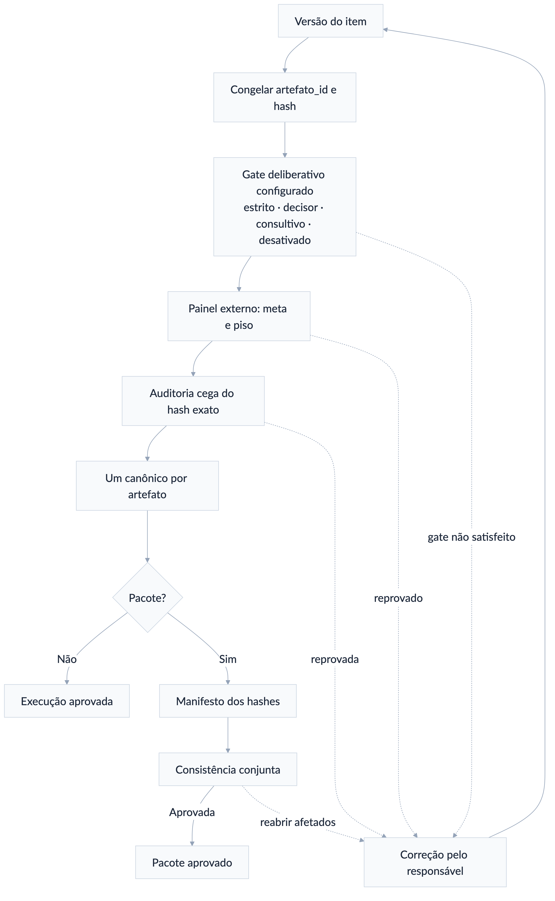

*Figura 7 — Debate, correção e novo consenso sobre cada versão do artefato.*

#### Ensemble profundo N×N

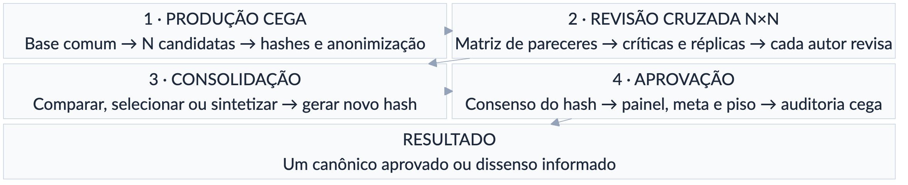

*Figura 8 — Matriz de revisão cruzada do ensemble N×N.*

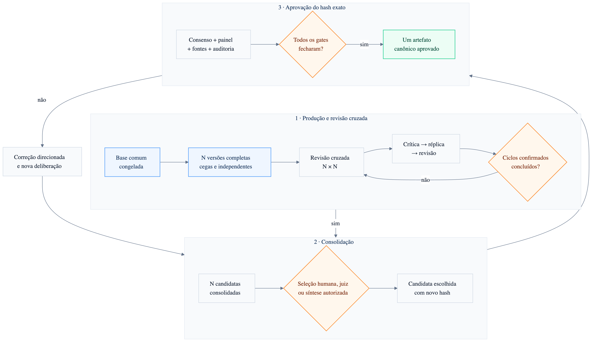

*Figura 9 — Produção independente, revisão cruzada, consolidação e gates finais.*

Use este perfil quando quiser que todos produzam sua própria versão, revisem as
versões dos demais e participem do debate antes da consolidação. A geração das
minutas já é a primeira etapa do ensemble; não é necessário executar um comando
separado para redigir e outro para ativar a matriz.

O fluxo completo é:

1. **Congelar a base comum.** Fixe objetivo, público, briefing, fatos, arquivos,
   fontes, estrutura, rubrica e `snapshot_sha256`. Todos recebem exatamente o
   mesmo material.
2. **Produzir versões cegas.** Cada uma das N cadeiras entrega uma candidata
   completa e independente, sem acesso às candidatas dos demais.
3. **Congelar e anonimizar.** O host registra autoria, modelo, sessão e hash,
   mas apresenta as candidatas aos revisores sem revelar os autores.
4. **Executar a matriz de revisão.** N revisores avaliam todas as N candidatas.
   A matriz estrita, com autorrevisão cega, produz N² pareceres por ciclo. Sem a
   diagonal, produz N×(N−1) e deve ser descrita como matriz sem autorrevisão.
5. **Debater de forma estruturada.** Cada autor recebe o agregado anonimizado
   das críticas sobre sua candidata, responde ponto por ponto e informa o que
   aceita, aceita parcialmente, rejeita com fundamento ou precisa esclarecer.
6. **Revisar as candidatas.** Cada autor entrega uma nova versão integral da
   própria candidata. Cada ciclo completo contém crítica → réplica → revisão e
   consome pelo menos três rodadas globais.
7. **Repetir os ciclos confirmados.** O modo profundo usa por padrão dois ciclos,
   equivalentes a pelo menos seis rodadas. O segundo ciclo avalia as versões
   revisadas, não reutiliza pareceres do hash anterior.
8. **Comparar e consolidar.** Um juiz, o usuário ou um consolidador designado
   seleciona uma candidata ou produz uma síntese fundamentada.
9. **Congelar a consolidação.** A selecionada ou a síntese recebe novo hash e
   estado `canonico_selecionado`. Ela ainda não está aprovada.
10. **Aplicar os gates finais.** Delibere sobre o hash consolidado, corrija
    bloqueios, repita o consenso quando o texto mudar e execute painel externo,
    meta, piso e auditoria cega. Somente então publique um
    `canonico_aprovado`.

Cada parecer deve registrar pontos fortes, erros, omissões, objeções materiais,
alterações acionáveis, condições para aprovação e notas pela rubrica comum. O
ledger preserva as críticas, réplicas, decisões editoriais, versões e hashes.

Use esta hierarquia de profundidade em qualquer domínio:

| Nível | Ciclos | Rodadas globais mínimas | Regra |
|---|---:|---:|---|
| Rápido | 1 | 3 | revisão cruzada única |
| Profundo — padrão | 2 | 6 | padrão do `ensemble_nxn_v1` |
| Máximo recomendado | até 6 | até 18 | confirmar custo e benefício |
| Excepcional | 7–12 | 19–36 | extensão gradual, justificada e confirmada |

Cada ciclo dá a cada cadeira direito a uma crítica, uma réplica e uma revisão.
O número de manifestações acompanha o número de ciclos; não existe o antigo
limite fixo de quatro quando uma extensão maior tiver sido confirmada.

Há quatro modos principais de encerramento do ensemble:

| Modo | Resultado antes dos gates |
|---|---|
| Juiz independente | Escolhe a melhor candidata existente e justifica a seleção |
| Escolha humana | Preserva todas as finalistas e aguarda a decisão do usuário |
| Consolidador designado | Sintetiza as melhores contribuições e registra o que incorporou ou rejeitou |
| Síntese pelo juiz | Produz uma nova candidata combinada quando isso tiver sido autorizado expressamente |

Seleção, vitória ou síntese não equivalem a aprovação. Uma síntese altera o
texto e, portanto, não herda consenso, notas nem auditoria das candidatas que a
originaram.

Se as minutas já existirem, elas podem entrar como candidatas somente depois de
serem congeladas e vinculadas ao mesmo briefing, rubrica e snapshot de fontes.
Se foram produzidas com bases incompatíveis, normalize a base ou gere novamente
as versões antes de chamar o resultado de ensemble cego comparável.

Exemplo completo com quatro agentes:

```text
/loop-debate-agentes use ensemble N×N profundo com Claude, Codex, Gemini e
Grok. Dê a todos o mesmo briefing, arquivos, fontes e rubrica. Cada agente deve
gerar cegamente uma versão completa. Faça matriz estrita 4×4 e dois ciclos de
crítica, réplica e revisão; cada autor revisa sua própria candidata. Preserve
as quatro finalistas e use Kimi como consolidador designado para produzir uma
síntese fundamentada. A síntese recebe novo hash: submeta-o a consenso estrito,
painel independente de 3 sessões, meta 8,5, piso 7 e auditoria cega. Se o texto
mudar, repita os gates. Publique somente um canônico aprovado e informe todo
dissenso material remanescente.
```

Para equilibrar qualidade, custo e tempo, use três ou quatro agentes e dois
ciclos como ponto de partida.

Acima de cinco agentes, confirme novamente o
custo, pois cada ciclo cresce quadraticamente: N produtores × N revisores = N²
pareceres, além das N réplicas e N revisões.

Produtores e revisores podem ser
conjuntos diferentes; se os tamanhos forem distintos, registre corretamente um
ensemble N×M.

A estimativa por tentativa é:

```text
N gerações + C × (N² críticas + N réplicas + N revisões)
+ 1 seleção ou síntese + painel externo
```

Num ensemble estrito 3×3, com dois ciclos e painel externo de três sessões,
isso representa aproximadamente 37 chamadas antes do consenso adicional e da
auditoria final. Um adaptador que combine réplica e revisão pode reduzir as
chamadas efetivas, mas não elimina nenhuma das fases lógicas.

#### Quem faz as correções?

```text
/loop-debate-agentes Claude redige a primeira versão, Codex critica e Gemini
consolida todas as versões seguintes. Preserve Claude como autor inicial.
```

Isso fixa `consolidador_designado = Gemini`. Sem essa instrução, o redator
original continua responsável pelas correções.

#### Duas ou mais versões finais

```text
/loop-debate-agentes ao final, Claude, Codex e Gemini produzem consolidações
cegas independentes. Preserve as três e aguarde minha escolha; não mescle nem
escolha automaticamente.
```

Cada consolidação é candidata. A escolhida ou sintetizada recebe novo hash e
precisa passar novamente pelo gate deliberativo configurado, pela avaliação e
pela auditoria antes de se tornar canônica.

### 6.2 `/redacao-juridica-consensual`

**Serve para:** aplicar o perfil jurídico `juridico_consensual_v2` ao motor
`debate_agents_v1` para produzir parecer, petição, contestação, recurso,
manifestação, despacho, decisão, sentença, voto ou pacote jurídico rastreável.

#### Receitas automáticas, sem novas skills

O comando identifica uma receita documental e a aplica como delta sobre o mesmo
perfil jurídico. Você não precisa memorizar o nome: basta pedir o documento em
linguagem natural. A escolha aparece na prévia **Entendi assim** antes das
chamadas externas.

| Receita | Quando é usada | Configuração indicativa |
|---|---|---|
| `parecer_consensual` | consulta, opinião legal, viabilidade ou risco | perfil comum; fontes, alternativas, riscos e conclusão |
| `peticao_consensual` | inicial, contestação, réplica, manifestação ou memoriais | perfil comum; fatos, prova, preliminares, mérito e pedidos |
| `recurso_consensual` | razões ou contrarrazões recursais | perfil complexo; 10 rodadas, 3 ciclos e gates de admissibilidade pertinentes |
| `minuta_decisoria` | decisão, sentença, voto, acórdão ou juízo de admissibilidade | imparcialidade, contraditório, fundamentação e dispositivo |
| `ensemble_juridico` | todos geram candidatas e todos revisam todas | overlay opt-in com matriz N×N cega |
| `pacote_processual` | vários documentos com aprovação e hash próprios | overlay opt-in com receita e auditoria por artefato |

Overrides explícitos prevalecem sobre a receita. A receita prevalece sobre os
defaults jurídicos, que prevalecem sobre o motor. Ensemble e pacote não são
ativados apenas porque há vários modelos ou dois produtos: precisam ser pedidos
expressamente ou propostos na prévia e confirmados.

As modalidades permanecem separadas:

- todos geram e todos revisam todos → `ensemble_juridico`;
- modelos geram versões finais independentes sem revisão N×N → `multipla_cega`;
- julgadores apresentam votos → formação colegiada;
- vários documentos com canônicos próprios → `pacote_processual`.

Exemplo simples:

```text
/redacao-juridica-consensual prepare uma apelação. Claude Opus 5 redige, Codex
critica e Grok 4.6 High audita. Use até 12 versões. Mantenha os demais padrões.
```

O sistema resolve `recurso_consensual`, preserva os modelos indicados e mostra
10 rodadas, 3 ciclos e 12 versões na prévia. Contrarrazões também usam a receita
recursal; juízo de admissibilidade redigido pelo órgão julgador usa
`minuta_decisoria`.

Exemplo composto:

```text
/redacao-juridica-consensual produza um pacote com parecer, recurso e minuta de
decisão. Use ensemble N×N somente no recurso: Claude Opus 5, Codex e Grok devem
gerar candidatas e revisar todas. Cada documento terá seu próprio hash,
consenso, auditoria e canônico.
```

Nesse caso, `pacote_processual` vale para o run, cada item recebe sua receita
documental e `ensemble_juridico` fica limitado ao `artefato_id` do recurso.

Exemplo de parecer:

```text
/redacao-juridica-consensual Claude Opus 5 redige um parecer sobre os documentos
anexos. Codex verifica fatos, fundamentos e precedentes; Gemini revisa a
estrutura; Kimi faz auditoria cega. Use até 5 tentativas, consenso estrito,
média 8,5 e piso 7. Não invente fatos ou citações e entregue um único parecer
canônico, sujeito a revisão humana profissional.
```

Exemplo de minuta decisória:

```text
/redacao-juridica-consensual Codex redige uma minuta de decisão imparcial a
partir dos autos indicados. Claude atua como oponente das duas teses, Gemini
verifica congruência e fontes e Grok audita. Preserve contraditório, competência,
cabimento e todos os pontos controvertidos.
```

Exemplo de acórdão com publicação *opinion of the court* e apuração global:

```text
/redacao-juridica-consensual forme um colegiado com Claude Opus 5, Codex e Grok
sobre a minuta atual. Use opinion_of_court e maioria simples. Cada julgador deve
votar no dispositivo pelo critério global e aderir separadamente a cada proposição essencial. Codex
redige a opinião da maioria; publique votos concorrentes e dissidentes. Exija
ratio unificada, repita o debate quando o hash mudar e use Kimi em auditoria
cega. Maioria não é consenso; entregue certidão, mapa de adesões, opinião
principal e votos separados.
```

Variações naturais:

```text
/redacao-juridica-consensual use seriatim: cada modelo produz seu voto completo,
apure o placar e identifique a ratio comum sem fundir artificialmente as razões.

/redacao-juridica-consensual use per_curiam com texto institucional impessoal e
maioria qualificada de dois terços. Preserve e publique eventual voto vencido.

/redacao-juridica-consensual use critério analítico issue-by-issue. Congele as
questões prejudiciais e de mérito e a regra que deriva o dispositivo antes dos
votos. Mostre as coalizões por questão, compare com os pacotes individuais e
informe toda maioria cruzada; não declare ratio comum sem coalizão do pacote.

/redacao-juridica-consensual use critério híbrido. Depois da apuração analítica,
exija confirmação bloqueante do dispositivo derivado. Se a confirmação falhar,
não proclame o resultado: devolva os pontos controvertidos ao loop.
```

No pacote colegiado, cada voto, a certidão, o mapa de adesões e a opinião
principal têm arquivo e hash próprios. A proclamação congela o conjunto.

Em
simulação brasileira, o voto vencido permanece publicado; uma opinião unificada
nunca apaga o dissenso.

Se houver maioria apenas no resultado, a saída informa
que não existe ratio unificada e não declara consenso.

O fluxo acrescenta gates jurídicos: briefing, jurisdição, posição processual,
fatos comprovados, fontes primárias, competência, cabimento, tempestividade,
congruência, argumentos contrários e revisão humana antes de protocolo,
assinatura ou decisão. Lacunas devem ser marcadas, nunca inventadas.

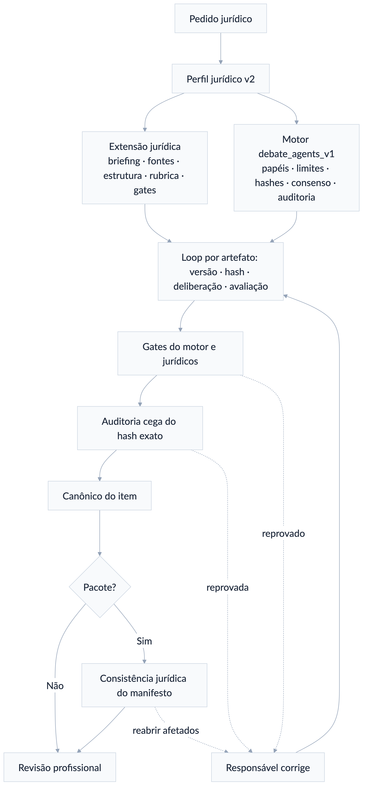

*Figura 10 — Fluxo integral da redação jurídica consensual e de seus artefatos.*

O perfil jurídico também aceita ensemble N×N e ensemble profundo. Assim, cada
modelo pode produzir sua própria minuta ou parecer, participar da revisão
cruzada e revisar sua candidata antes de uma seleção ou síntese.

A consolidação
jurídica recebe novo hash e precisa passar novamente pelo consenso e pelos gates
jurídicos; nenhuma aprovação de uma candidata é transferida para a síntese.

```text
/redacao-juridica-consensual use ensemble N×N profundo com Claude Opus 5, Codex,
Kimi e Grok para produzir quatro minutas independentes a partir dos mesmos autos
e fontes. Faça revisão cega 4×4 e dois ciclos de crítica, réplica e revisão.
Depois, use Gemini como consolidador designado. Submeta a síntese a consenso
estrito, verificação das citações, painel 3, meta 8,5, piso 7, auditoria cega e
revisão humana profissional. Preserve as candidatas e entregue somente uma
minuta canônica aprovada.
```

A skill jurídica não duplica o loop. Papéis, modelos, rodadas, tentativas,
consenso, versões, hashes, candidatos, canônicos e auditoria permanecem sob
controle de `/loop-debate-agentes`. O perfil jurídico acrescenta apenas fontes,
estruturas, rubrica, categorias de objeção, gates jurídicos e consistência do
pacote.

#### Minuta limpa e minuta com alterações após o loop

O controle `legal_word_redline_v1` é ativado automaticamente quando já existe
um DOCX ou por pedido expresso. O comparador roda localmente, gera revisões
OOXML nativas reconhecidas pelo Word e não envia o documento a um serviço
externo.

```text
minuta-v01-limpa.docx
  → crítica de Codex/Grok
  → réplica e revisão do redator
minuta-v02-limpa.docx
  → comparativo incremental v01 → v02
  → novas rodadas e tentativas
minuta-vNN-limpa.docx
  → consenso + painel + auditoria sobre seu hash
  → minuta-final-limpa.docx
  → comparativo acumulado v01/original → final
  → minuta-final-com-alteracoes.docx
```

`NN` pode chegar a 20. Isso produz no máximo 20 DOCX limpos e 19 comparativos
incrementais; os comparativos são derivados e não contam como novas versões.

Ao terminar todos os debates e loops, portanto, há duas apresentações da mesma
decisão editorial:

| Saída | Função | Estado |
|---|---|---|
| `minuta-final-limpa.docx` | texto exato submetido aos gates | único canônico aprovado |
| `minuta-final-com-alteracoes.docx` | mostra da base confirmada até a final | derivado rastreável, não canônico |
| `minuta-final-alteracoes-ultima-versao.docx` | mostra somente a última revisão | derivado opcional |

O manifesto prova duas direções: aceitar todas as revisões reproduz o conteúdo
da minuta final limpa; rejeitar todas reproduz a base.

O consenso e a auditoria aderem apenas ao SHA-256 da limpa. Se o usuário aceitar, rejeitar ou editar
parcialmente o comparativo no Word, o resultado é uma nova versão: salve-o como
DOCX limpo, gere novo hash e repita os gates aplicáveis.

Não use cor, destaque
ou tachado como imitação de controle nativo.

Defaults jurídicos: `estrito + sempre`, 8 rodadas, 2 ciclos, 6 tentativas/versões,
painel 3, meta 8,5, piso 7 e auditoria cega 1. No ensemble profundo, o padrão
específico também é 2 ciclos, equivalentes a pelo menos 6 rodadas globais.

Configurações maiores são admitidas caso a caso: até 18/6 na faixa recomendada
e até 36/12 somente na faixa excepcional confirmada; o teto separado de
versões completas é 20 por artefato.

Exemplo completo, pronto para uso:

```text
/redacao-juridica-consensual use ensemble N×N profundo com Claude Opus 5, Codex
e Kimi. Forneça a todos o mesmo conjunto de autos, fatos, fontes e critérios
jurídicos. Cada modelo deve produzir cegamente uma minuta completa e
independente.

Execute uma matriz cega 3×3 na qual todos avaliam todas as minutas, incluindo
autorrevisão cega. Faça dois ciclos completos de crítica, réplica e revisão.
Cada autor continuará responsável por revisar a própria minuta.

Preserve as três versões consolidadas e encarregue o Codex, em sessão
independente, de selecionar a melhor ou produzir uma síntese fundamentada. A
seleção não significa aprovação. Submeta o hash exato da versão selecionada ou
sintetizada a consenso estrito, painel independente de três sessões, média
mínima 8,5, piso 7 em cada critério, verificação das fontes e auditoria cega
final.

Se houver bloqueio material ou dissenso relevante, não declare consenso:
identifique os pontos controvertidos e encaminhe-os para decisão humana.
Mantenha somente uma minuta como artefato canônico aprovado e preserve as
demais como candidatas para auditoria.
```

Exemplo de pacote jurídico:

```text
/redacao-juridica-consensual produza parecer, petição e minuta de decisão com o
mesmo snapshot de fatos e fontes. Execute gates e auditoria próprios por item e
aprove o pacote somente após a consistência jurídica conjunta. Use consenso
estrito na petição, consultivo se necessário no parecer e desativado + nenhum
na minuta.
```

## 7. Workflows formais

`/workflow-agentes` e seus sete comandos especializados organizam a execução.
Eles produzem candidatas rastreáveis; não aprovam automaticamente o conteúdo.

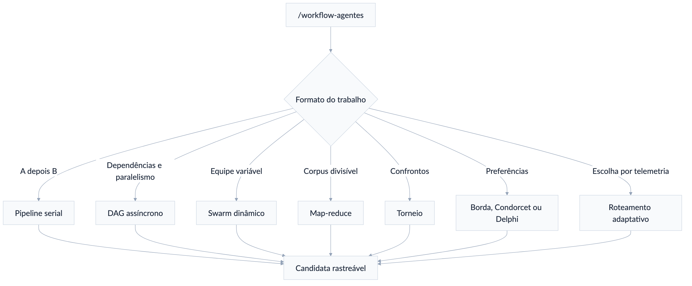

*Figura 11 — Protocolos formais disponíveis para organizar o trabalho multiagente.*

### 7.1 `/workflow-agentes`

**Serve para:** descrever o objetivo em linguagem natural e deixar o sistema
escolher o protocolo mais simples compatível.

```text
/workflow-agentes analise 200 decisões, extraia teses por processo, consolide
os padrões e audite uma amostra. Use Kimi, DeepSeek, Qwen e Gemini.
```

O sistema provavelmente proporá map-reduce e mostrará a estrutura, participantes,
paralelismo, limites e integração com o loop antes de executar.

### 7.2 `/pipeline-agentes`

**Serve para:** uma sequência obrigatória A → B → C → D.

```text
/pipeline-agentes @claude-opus-redator cria a especificação; depois
@gpt-codex-critico emite parecer; @gemini-pro-consolidador produz a candidata;
por fim @kimi-auditor faz auditoria somente leitura.
```

Cada etapa recebe apenas as entradas declaradas e só avança quando a saída é
válida. Se uma etapa for refeita, todas as etapas posteriores dependentes ficam
inválidas. Use DAG se houver ramos paralelos.

**Caso concreto:** pesquisa → redação → revisão → publicação preparada, com
handoffs auditáveis.

### 7.3 `/dag-agentes`

**Serve para:** tarefas com dependências, ondas paralelas e pontos de junção.

```text
/dag-agentes Kimi pesquisa fontes e Claude desenha a arquitetura em paralelo.
Codex implementa somente depois das duas saídas. Gemini audita depois da
implementação. Máximo de 3 nós em paralelo.
```

O grafo precisa ser acíclico. Cada nó tem sessão e artefatos próprios. Um `join`
pode exigir todos, um quórum ou qualquer predecessor, conforme a configuração.

**Caso concreto:** pesquisa e arquitetura independentes convergem para uma
implementação única.

### 7.4 `/swarm-agentes`

**Serve para:** exploração aberta com supervisor e equipe que pode mudar dentro
de um pool previamente autorizado.

```text
/swarm-agentes use @claude-opus-juiz como supervisor. Pool permitido:
@gpt-codex, @gemini-pro, @grok, @deepseek, @qwen-coder e @kimi. Comece com
Codex e Kimi; permita até 5 membros, 3 expansões e 4 gerações para investigar
a causa da regressão.
```

O supervisor só recruta quando identifica lacuna material e nunca fora do pool.
Remover um membro não apaga suas contribuições ou dissensos.

**Caso concreto:** incidente complexo no qual novas especialidades podem ser
necessárias conforme surgem evidências.

### 7.5 `/map-reduce-agentes`

**Serve para:** dividir um grande conjunto em partes independentes, processar em
paralelo e consolidar com procedência.

```text
/map-reduce-agentes divida os 300 arquivos por módulo. Kimi, DeepSeek e Qwen
extraem achados com caminho:linha; agrupe por tipo de risco; Claude reduz e
Gemini audita cobertura e duplicação.
```

Fases: particionar → mapear → agrupar → reduzir → auditar. Cada achado mantém o
shard, a localização e o hash de origem. Falha de shard deve ser repetida ou
declarada como cobertura incompleta.

**Caso concreto:** revisar grande base de código, decisões judiciais ou conjunto
de contratos.

### 7.6 `/torneio-agentes`

**Serve para:** selecionar entre candidatas comparáveis por confrontos cegos.

```text
/torneio-agentes compare quatro propostas de arquitetura em eliminação simples.
Use 3 juízes por confronto, rubrica de correção, cobertura, clareza e risco,
seed 42 e juiz holdout no desempate. Oculte a autoria.
```

Candidatas, hashes, chave, juízes, rubrica e desempate são congelados antes do
primeiro confronto. O vencedor recebe o estado `candidato_selecionado`, não
`canonico_aprovado`.

**Caso concreto:** escolher a melhor entre quatro implementações produzidas de
forma independente.

### 7.7 `/votacao-agentes`

**Serve para:** agregar preferências por Borda, Condorcet ou Delphi.

#### Borda

Cada eleitor ordena as opções; a soma das posições determina a vencedora.

```text
/votacao-agentes use Borda para ordenar as propostas A, B, C e D. Eleitores:
Claude, Codex e Gemini. Oculte autoria e use Kimi no desempate.
```

#### Condorcet

Compara todas as opções em pares. Pode não existir vencedor se houver ciclo.

```text
/votacao-agentes use Condorcet entre A, B e C. Se houver ciclo, não invente
vencedor; devolva a matriz e aguarde escolha humana.
```

#### Delphi

Especialistas respondem anonimamente, recebem estatísticas e argumentos
agregados e revisam suas estimativas até estabilidade ou limite.

O runtime determinístico apura cada rodada, mediana, intervalo interquartil, duas verificações
estáveis e dissensos finais. O host continua responsável por congelar e distribuir o resumo
anonimizado entre as rodadas; o resultado é `convergencia_consultiva`, nunca aprovação.
O campo canônico é `estabilidade_exigida`; `estabilidade` permanece como alias legado. Booleanos,
valores não finitos e estabilidade menor que 2 são rejeitados.

```text
/votacao-agentes use Delphi com Claude, Codex, Gemini e Grok para estimar o
prazo. Faça até 4 rodadas, exija estabilidade por 2 e preserve estimativas
minoritárias de risco.
```

Votação seleciona ou mede convergência; não substitui consenso deliberativo nem
auditoria de qualidade.

Borda e Condorcet normalmente escolhem entre candidatas;
Delphi busca estabilidade de estimativas ou opiniões. Depois dessa escolha, uma
decisão jurídica ainda pode usar `seriatim`, `per_curiam` ou
`opinion_of_court` para apurar dispositivo, fundamentos comuns e votos
separados. São etapas combináveis, não métodos rivais.

### 7.8 `/roteamento-adaptativo`

**Serve para:** escolher ou trocar modelos entre tarefas ou tentativas com base
em qualidade observada, custo, latência, falha e diversidade.

```text
/roteamento-adaptativo pool fechado: @claude-opus, @gpt-codex,
@gemini-pro, @grok e @qwen-coder. Peso 55% qualidade, 15% custo, 15% latência,
10% falha e 5% diversidade. Exploração 10%. Pause se nenhum atender aos limites.
```

O roteador:

1. filtra por capacidades, autenticação, permissão e limites;
2. normaliza somente métricas conhecidas;
3. calcula ranking com pesos congelados;
4. fixa um modelo para a tarefa inteira;
5. atualiza métricas após resultado verificável.

Custo desconhecido nunca vale zero. O roteador não pode sair do pool nem trocar
o modelo no meio de uma resposta.

## 8. Histórico do Agent Council

Estes quatro comandos operam sobre sessões produzidas por `/council`.

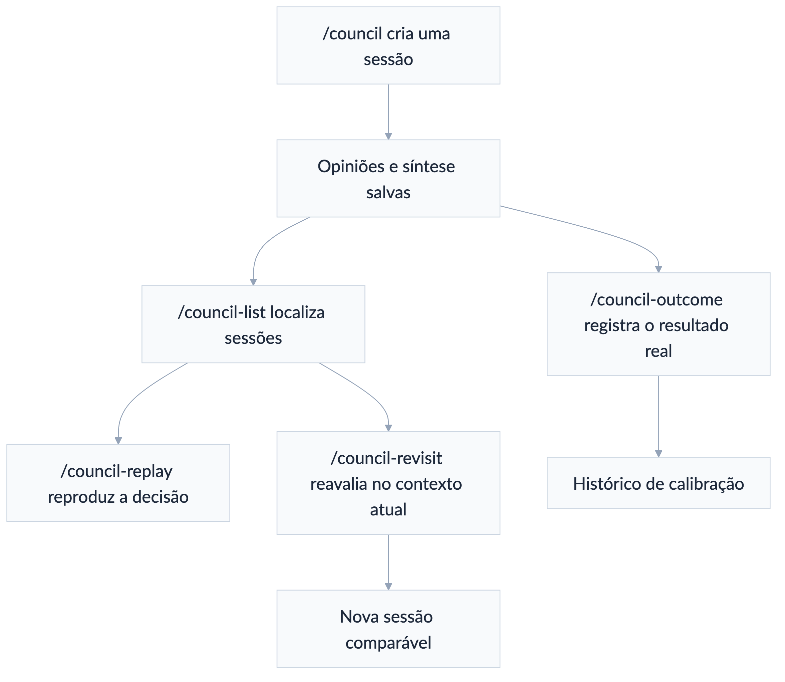

*Figura 12 — Persistência, retomada, replay e encerramento de sessões do Council.*

### 8.1 `/council-list`

Lista as sessões do projeto atual, com identificador, modo, quantidade de
agentes e pergunta.

```text
/council-list
/council-list autenticação
```

### 8.2 `/council-replay`

Reproduz a pergunta, as opiniões e a síntese de uma sessão existente.

```text
/council-replay 20260811-153000-auth-strategy
```

Use para auditar como a recomendação foi formada, sem executar o conselho de
novo.

### 8.3 `/council-revisit`

Refaz a mesma pergunta usando o estado atual do projeto e permite comparar a
nova deliberação com a original.

```text
/council-revisit 20260811-153000-auth-strategy
```

**Caso concreto:** a arquitetura mudou e você quer saber se a decisão anterior
ainda se sustenta.

### 8.4 `/council-outcome`

Registra o que ocorreu depois da decisão, criando dados de calibração.

```text
/council-outcome 20260811-153000-auth-strategy "A migração reduziu a latência
em 22%, mas aumentou o custo em 8%."
```

O resultado fica associado à sessão e aparece no visualizador.

## 9. Agentes nomeados no OpenCode e seats externas

O OpenCode possui oito famílias configuradas. Quando nenhuma identidade ou
modelo for informado, a sessão usa `opencode-go/glm-5.3` por padrão; uma escolha
explícita feita pelo usuário continua prevalecendo. Kimi, GLM, DeepSeek e Qwen
usam sempre esforço `max`; uma configuração inferior é recusada, não aplicada
silenciosamente:

| Identidade base | Modelo local configurado |
|---|---|
| `@claude-opus` | Claude Code · `claude-opus-5` |
| `@gpt-codex` | Codex CLI · `gpt-5.6-sol`, esforço `xhigh` |
| `@gemini-pro` | Antigravity CLI · `gemini-3.7-flash-high` |
| `@grok` | ponte para Cursor CLI · `cursor-grok-4.6-high` |
| `@glm` | `opencode-go/glm-5.3` |
| `@deepseek` | `opencode-go/deepseek-v4-pro` |
| `@qwen-coder` | `opencode-go/qwen3.8-max` |
| `@kimi` | seat canônica externa: Kimi Code · `kimi-code/k3`, usando os créditos OpenCode Go; o perfil OpenCode homônimo é apenas legado explícito |

Cada base tem identidades funcionais:

```text
@<modelo>-redator
@<modelo>-pesquisador
@<modelo>-critico
@<modelo>-revisor
@<modelo>-consolidador
@<modelo>-juiz
@<modelo>-auditor
@<modelo>-executor
```

Exemplos:

```text
@claude-opus-redator produza a primeira versão da especificação.
@gpt-codex-critico critique a versão sem editá-la.
@gemini-pro-consolidador incorpore somente as alterações aceitas.
@glm-redator produza a candidata principal com GLM-5.3.
@gpt-codex-revisor publique uma candidata própria para revisão cruzada.
@kimi-auditor audite a versão final em sessão cega.
```

A identidade base é multiuso:

```text
@grok atue como pesquisador neste passo e como crítico no passo seguinte.
```

Use identidades com sufixo quando quiser função e permissões mais rígidas. Use a
identidade base quando o papel for definido caso a caso. Dois nomes funcionais
do mesmo modelo não contam como modelos independentes.

Os identificadores refletem a configuração local atual. As identidades Grok no
OpenCode são pontes para `cursor-grok-4.6-high` no Cursor.

Nos comandos
multiagente, `@codex` resolve para o Codex CLI com `gpt-5.6-sol` e esforço
`xhigh`, `@kimi` resolve para Kimi Code/K3 e `@gemini` para
Antigravity/Gemini 3.7. A identidade `@gpt-codex` da tabela acima continua sendo
um agente interno do OpenCode e não substitui a cadeira Codex. Perfis homônimos
internos do OpenCode só podem ser usados quando o usuário pedir explicitamente a
rota OpenCode. Nunca permita substituição silenciosa durante um run já
confirmado.

A credencial OpenCode Go reutilizada pelo Kimi não fica em claro no
`config.toml`. Ela é guardada no Keychain do macOS sob o serviço
`multiagente.kimi-opencode-go`; o bridge usa `kimi-secure`, que injeta o
provider temporariamente em memória por `KIMI_MODEL_*`. Em terminal interativo,
o instalador configura `kimi` como alias do wrapper e preserva
`kimi-original` para atualização ou diagnóstico do binário oficial.

Para reinstalar ou reparar esse vínculo sem imprimir a chave:

```bash
python3 ~/plugins/multiagente-consensual/scripts/install_kimi_keychain.py
kimi-secure provider list
```

## 10. Receitas completas

### 10.1 Decisão técnica rápida

```text
/a2a-broadcast Analise o diff atual e indique o risco mais urgente, com um teste
capaz de confirmar ou refutar a hipótese.
```

Use quando você quer amplitude, não deliberação. Em seguida, se as respostas
divergirem materialmente:

```text
/a2a-debate Confrontem as três hipóteses anteriores e indiquem quais evidências
no repositório sustentam cada uma.
```

### 10.2 Implementação com revisão e aprovação

```text
/loop-debate-agentes Codex implementa a feature. Claude critica arquitetura,
segurança e testes; Codex responde e corrige. Debate sempre em cada nova versão,
até 4 rodadas por tentativa e 5 tentativas. Painel de 3 sessões, meta 8,5,
piso 7 e Gemini como auditor cego. Não aprove se houver dissenso material.
```

Resultado esperado: código ou patch canônico, hashes das versões, críticas,
notas, auditoria e dissensos remanescentes.

### 10.3 Parecer jurídico com fontes verificadas

```text
/redacao-juridica-consensual Claude redige parecer consultivo com base nos
documentos anexos e em fontes oficiais vigentes até hoje. Codex confronta fatos,
teses e citações; Gemini consolida as versões seguintes; Kimi audita cegamente.
Use o perfil jurídico comum: até 5 tentativas, 8 rodadas, 2 ciclos, consenso
estrito sempre, meta 8,5 e piso 7. Marque qualquer dado não confirmado e não
invente precedente.
```

### 10.4 Revisão de repositório grande

```text
/map-reduce-agentes divida o repositório por domínio. Qwen e Codex mapeiam bugs,
Kimi mapeia riscos de privacidade e DeepSeek busca referências residuais ao
módulo antigo. Agrupe por severidade e domínio; Claude reduz; Gemini audita a
cobertura. Encaminhe a candidata ao loop somente se houver correções propostas.
```

### 10.5 Quatro implementações concorrentes

```text
/loop-debate-agentes use ensemble N×N com Claude, Codex, Gemini e Qwen. Cada um
gera uma implementação e revisa todas as quatro, em 2 ciclos. Use Grok como juiz
cego. Depois submeta a vencedora a um painel de segurança e a Kimi em auditoria
cega. Preserve todas as candidatas e não confunda seleção com aprovação.
```

### 10.6 Projeto com pesquisa e execução paralelas

```text
/dag-agentes Kimi pesquisa a API externa e Gemini verifica limitações jurídicas
em paralelo. Claude define a arquitetura depois das duas análises. Codex
implementa depois da arquitetura. Qwen cria os testes em paralelo com a
documentação de Claude. Gemini audita o join final.
```

### 10.7 Escolha humana entre consolidações finais

```text
/loop-debate-agentes após o debate, Claude, Codex e Gemini produzem versões
finais independentes e cegas. Avalie cada uma com a mesma rubrica, preserve as
três e mostre comparação lado a lado. Não selecione nem sintetize sem minha
decisão. Depois da escolha, execute o gate deliberativo configurado, a
avaliação e a auditoria no hash escolhido.
```

### 10.8 Acórdão com opinião da maioria e dissidência

```text
/redacao-juridica-consensual Claude Opus 5, Codex, Kimi e Grok julgam a minuta
congelada. Use opinion_of_court, maioria simples e quórum 4. Faça até 8 rodadas
e 2 ciclos de crítica, réplica e revisão. Cada julgador vota no dispositivo e
adere por ID a cada proposição essencial. Claude Opus 5 redige a opinião da
maioria somente com os fundamentos que atingirem o limiar; os não aderentes
produzem votos concorrentes ou dissidentes. Exija ratio unificada, publique
todos os votos separados, preserve os hashes e use Codex em nova sessão para a
auditoria cega. Se houver maioria apenas no resultado, reabra o loop ou informe
o dissenso; não declare consenso nem canônico aprovado.
```

Resultado esperado: uma certidão reproduzível, mapa de adesões, opinião
principal, opiniões separadas, recibo colegiado e, somente depois dos demais
gates, um artefato canônico aprovado.

### 10.9 Prompt completo para parecer jurídico — Claude, Codex e Grok

Este modelo parte do Claude Code porque o Claude Opus 5 será o redator original.
Abra o terminal na pasta do caso, valide as rotas e inicie o Claude em comandos
separados:

```bash
cd "/Users/SEU-USUARIO/Documents/NOME-DO-CASO"
```

```bash
multiagent-bridge doctor --deep
```

```bash
claude
```

No Claude Code, cole o pedido abaixo. Substitua os campos entre colchetes antes
de confirmar a prévia **Entendi assim**.

```text
/redacao-juridica-consensual

Produza um parecer jurídico completo com base exclusivamente nos documentos
existentes nesta pasta e nas fontes primárias oficiais que possam ser
verificadas.

OBJETO
Analise: [DESCREVA A QUESTÃO JURÍDICA].

CONTEXTO E LIMITES
- Jurisdição e ramo: [INFORMAR].
- Consulente e finalidade: [INFORMAR].
- Posição a examinar: [IMPARCIAL / DEFESA DE TESE ESPECÍFICA].
- Data de corte: [AAAA-MM-DD].
- Não invente fatos, provas, normas, julgados, números de processo, relatores,
  datas ou citações.
- Para qualquer lacuna, use [INFORMAR], [CONFIRMAR] ou [NÃO CONSTA].
- Não exponha segredos, credenciais ou dados pessoais desnecessários.

PAPÉIS E ROTAS OBRIGATÓRIAS
- Redator e consolidador iterativo: Claude Opus 5, exclusivamente pelo Claude
  Code. O Claude cria a primeira versão, responde a cada objeção e permanece
  responsável por todas as correções do artefato canônico.
- Avaliador-crítico: Codex, em sessão separada. Deve confrontar fatos, provas,
  normas, precedentes, coerência, riscos e citações; pode sugerir patch ou
  artefato alternativo, mas nunca substituir silenciosamente o canônico.
- Oponente adversarial: Grok 4.6 High, exclusivamente pelo Cursor na rota
  cursor-grok-4.6-high. Deve construir a melhor tese contrária, buscar omissões,
  fragilidades probatórias e consequências práticas.
- Não substitua modelo, provedor, CLI ou cadeira indisponível. Pause e informe.

DOCUMENTOS E FONTES
1. Leia recursivamente os arquivos pertinentes desta pasta, sem sair dela para
   procurar documentos locais não autorizados.
2. Antes da redação, gere manifesto com caminho relativo, tamanho e SHA-256 de
   cada arquivo utilizado.
3. Entregue às três cadeiras o mesmo snapshot dos documentos, fatos, questões,
   rubrica e fontes.
4. Separe alegação, fato comprovado, inferência e lacuna probatória.
5. Para cada afirmação material, vincule o documento, página, item ou trecho.
6. Verifique legislação, atos e precedentes decisivos em fonte primária oficial;
   registre órgão, identificação, julgamento/publicação, URL, data de acesso e
   aderência ao caso.
7. Não trate ementa, notícia, resumo ou fonte secundária como substituto do
   inteiro teor quando este for material para a conclusão.

ESTRUTURA DO PARECER
Inclua ementa; consulta e limites; relatório dos fatos e documentos; questões
jurídicas; premissas e data de corte; marco normativo e vigência; jurisprudência
com aderência e distinções; aplicação ao caso; teses contrárias; riscos e
incertezas; conclusão objetiva por questão; providências e recibo de fontes.

FLUXO DE REDAÇÃO, CRÍTICA E REVISÃO
1. Claude produz a versão completa v1 sem ver pareceres ainda inexistentes.
2. Congele a versão e registre seu SHA-256.
3. Codex e Grok avaliam exatamente o mesmo hash, em sessões separadas.
4. Cada avaliação deve informar: pontos aprovados; erros factuais ou jurídicos;
   objeções materiais; trecho afetado; evidência; alteração proposta; condição
   objetiva para aprovação; notas por critério.
5. Claude responde item por item com aceita, aceita parcialmente, rejeitada com
   evidência ou esclarecimento solicitado.
6. Claude produz uma nova versão completa. Toda alteração gera novo hash e
   invalida consenso, notas e auditoria do hash anterior.
7. Repita crítica, réplica e revisão por até 2 ciclos completos e 8 rodadas
   globais por tentativa, usando menos se o texto já estiver completo.
8. Faça até 5 tentativas de melhoria. Pare após dois ciclos consecutivos sem
   progresso mensurável e informe o bloqueio.

CONTROLE DE ALTERAÇÕES DO WORD
- Ative legal_word_redline_v1 com processamento local e base acumulada
  `primeira`.
- Cada versão v1, v2 e seguintes deve existir primeiro como DOCX limpo,
  congelado e com hash próprio.
- Depois de cada correção substantiva, gere também
  `parecer-vNN-alteracoes-vAA-vNN.docx`, comparando a versão limpa anterior
  com a corrente.
- Após todos os debates, tentativas, consenso, painel e auditoria, publique
  `parecer-final-limpo.docx` como único canônico e
  `parecer-final-com-alteracoes.docx` como comparação acumulada da v1 com a
  versão final exata.
- Verifique que aceitar tudo reproduz o conteúdo final e rejeitar tudo reproduz
  a base. A aprovação adere somente ao hash do arquivo limpo.
- Se eu aceitar, rejeitar ou editar parcialmente o comparativo no Word, salve o
  resultado como nova versão limpa e repita consenso, notas e auditoria.
- Se o runtime estiver indisponível, pause; não simule alterações nativas com
  cor, destaque, tachado ou comentários.

CONSENSO E QUALIDADE
- Modo: consenso estrito, executado sempre sobre cada nova versão.
- Exija consenso estável em 2 verificações consecutivas do mesmo hash.
- Exija média mínima 8,5 e piso 7,0 em clareza, profundidade, coerência,
  precisão conceitual e qualidade da explicação.
- Nenhuma nota compensa fato inventado, fonte decisiva não verificada,
  contradição, tese contrária material omitida ou objeção bloqueante aberta.
- Use painel externo de 3 sessões separadas, com Claude, Codex e Grok sob a
  mesma rubrica. Recalcule as notas fora dos modelos.

AUDITORIA FINAL
Depois do consenso e das notas, faça auditoria cega em nova sessão do Codex ou
do Grok, sem histórico, críticas, autores ou notas anteriores. O auditor recebe
somente o hash final, o briefing, a rubrica e o snapshot de fontes. Qualquer
alteração posterior exige nova auditoria.

DISSENSO
Se não houver consenso, não invente vencedor. Liste ponto por ponto: posição de
cada cadeira, evidências, impacto, alteração necessária e matéria que depende de
decisão humana. Não rotule maioria ou decisão de terceiro como consenso.

SESSÕES E HISTÓRICO
- Ative persistir_sessoes_nativas: true.
- Mantenha uma sessão própria por invocação e nunca reutilize sessão entre
  autores cegos, painel e auditor.
- O ledger central, os hashes e os recibos continuam canônicos; as sessões das
  CLIs são apenas espelhos consultáveis.

SAÍDAS NA PASTA DO CASO
Crie uma subpasta resultado-parecer com:
- parecer-final.md, parecer-final-limpo.docx e parecer-final.pdf;
- parecer-final-com-alteracoes.docx e, quando houver versão imediatamente
  anterior, parecer-final-alteracoes-ultima-versao.docx;
- versões limpas e comparativos incrementais de cada revisão;
- manifesto-controle-alteracoes.json e relatorio-de-alteracoes.md;
- manifesto-documentos.json e manifesto-fontes.json;
- matriz-fato-prova-fonte.md;
- ledger-decisoes.jsonl;
- avaliações, recibos, hashes e relatório de dissenso, se houver.

Mantenha exatamente um parecer como artefato canônico aprovado. Preserve
alternativas apenas como candidatas auditáveis. Não assine, protocole, envie ou
apresente o documento em nome do usuário. Exija revisão profissional humana
antes do uso.

Antes de qualquer chamada externa ou criação do run, mostre o bloco Entendi
assim com papéis, rotas, pasta-raiz, fontes, rodadas, ciclos, tentativas,
consenso, painel, auditoria, persistência de sessões, controle de alterações,
base do comparativo final e saídas. Aguarde minha
confirmação explícita.
```

### 10.10 Prompt completo para petições judiciais e recursos

Use este modelo para petição inicial, contestação, réplica, manifestação,
incidente, cumprimento, contrarrazões ou recurso. Ele não escolhe silenciosamente
o instrumento: se o cabimento estiver ambíguo, a equipe deve apresentar as
alternativas e aguardar decisão humana antes de redigir.

```text
/redacao-juridica-consensual

Produza a peça judicial adequada com base exclusivamente nos autos e documentos
existentes nesta pasta e nas fontes primárias oficiais verificáveis.

OBJETO PROCESSUAL
- Peça ou recurso pretendido: [INFORMAR OU PEDIR ANÁLISE DE CABIMENTO].
- Processo, órgão, instância e ramo: [INFORMAR].
- Parte representada e posição processual: [INFORMAR].
- Ato impugnado ou providência pretendida: [INFORMAR].
- Resultado prático autorizado pelo cliente: [INFORMAR].
- Data de corte: [AAAA-MM-DD].
- Urgência, sigilo ou gratuidade: [INFORMAR / NÃO CONSTA].

REGRAS DE SEGURANÇA JURÍDICA
- Não invente fatos, provas, datas, intimações, feriados, pedidos, renúncias,
  confissões, normas, julgados, números de processo, relatores ou citações.
- Não escolha tese, pedido ou recurso materialmente diferente sem autorização.
- Use [INFORMAR], [CONFIRMAR] e [NÃO CONSTA] para lacunas.
- Não assine, protocole, envie ou pratique ato processual.
- Exija revisão e decisão final de profissional habilitado.

PAPÉIS E ROTAS OBRIGATÓRIAS
- Redator e consolidador iterativo: Claude Opus 5, exclusivamente pelo Claude
  Code. O Claude cria a peça e continua responsável pelas correções.
- Revisor processual e factual: Codex, em sessão separada. Deve verificar autos,
  cronologia, prova, cabimento, admissibilidade, dialeticidade, fundamentação,
  pedidos e citações. Pode propor patch ou candidata completa, sem substituir o
  canônico.
- Oponente e julgador adversarial: Grok 4.6 High, exclusivamente pelo Cursor na
  rota cursor-grok-4.6-high. Deve formular a melhor resposta da parte contrária
  e os fundamentos plausíveis de inadmissão ou improcedência.
- Não faça fallback ou substituição silenciosa de modelo, CLI ou provedor.

TRIAGEM DOS AUTOS
1. Leia recursivamente os arquivos pertinentes da pasta autorizada.
2. Gere manifesto com caminho relativo, tamanho e SHA-256 de cada documento.
3. Construa linha do tempo processual e matriz fato-prova-fonte, separando
   alegação, prova, inferência e lacuna.
4. Identifique a última decisão, o evento de ciência/intimação, manifestações já
   apresentadas, pedidos pendentes e preclusões possíveis.
5. Entregue às três cadeiras o mesmo snapshot dos autos, fontes e critérios.

PORTÃO PROCESSUAL OBRIGATÓRIO
Antes da redação, e novamente antes da aprovação, verifique quando pertinente:
- competência, endereçamento, rito e fase processual;
- capacidade, representação, legitimidade e interesse;
- adequação e cabimento do instrumento;
- tempestividade, com memória de cálculo baseada apenas em datas comprovadas,
  calendário aplicável e regras vigentes;
- preparo, porte, gratuidade e demais recolhimentos;
- regularidade formal e documentos obrigatórios;
- dialeticidade e impugnação específica dos fundamentos relevantes;
- preclusão, coisa julgada, interesse recursal e sucumbência;
- exaurimento, prequestionamento, repercussão geral, relevância, transcendência
  ou demonstração de divergência, somente quando aplicáveis;
- efeitos, tutela provisória, efeito suspensivo e risco de dano;
- coerência entre fatos, fundamentos, pedidos e resultado autorizado.

Se faltar dado necessário para qualquer portão, não presuma aprovação: marque o
item como NÃO CONFIRMADO, explique o risco e peça decisão ou documento humano.
Se houver dúvida real entre instrumentos, apresente quadro comparativo de
cabimento, prazo, risco e consequência; aguarde escolha antes da versão canônica.

ESTRUTURA DA PEÇA
Adapte ao órgão, rito e fase. Inclua, quando cabível: endereçamento; processo e
partes; nome e fundamento do instrumento; síntese comprovada dos fatos;
admissibilidade e questões preliminares; mérito por tese; enfrentamento dos
argumentos contrários; provas; pedidos certos, coerentes e hierarquizados;
requerimentos subsidiários apenas se autorizados; valor da causa, fechamento e
documentos anexos.

Para recursos, delimite especificamente o ato recorrido, capítulos impugnados,
razões de reforma, invalidação, integração ou esclarecimento, efeitos e pedidos.
Não use fundamentação genérica que deixe de enfrentar a decisão recorrida.

MODO DE ARTEFATOS
- Para peça simples, use artefato_unico e mantenha exatamente um canônico.
- Quando o recurso exigir petição de interposição e razões separadas, use
  pacote_multi_artefato com os itens peticao-interposicao e razoes-recursais.
- Aprove cada item obrigatório por seu próprio hash e só aprove o pacote depois
  da auditoria conjunta de partes, datas, fundamentos, pedidos e anexos.
- Checklists, linhas do tempo e versões alternativas são auxiliares ou
  candidatas; não substituem a peça canônica.

FLUXO DE REDAÇÃO, CRÍTICA E REVISÃO
1. Claude produz a versão completa v1 do artefato ou de cada item do pacote.
2. Congele os arquivos e registre os hashes.
3. Codex faz revisão processual, factual e de fontes sobre os hashes exatos.
4. Grok produz crítica adversarial como contraparte e julgador de
   admissibilidade/mérito.
5. Cada crítica localiza o trecho, explica impacto, apresenta evidência, propõe
   correção testável e declara a condição de aprovação.
6. Claude responde a cada objeção com aceita, aceita parcialmente, rejeitada com
   evidência ou esclarecimento solicitado e gera nova versão completa.
7. Cada nova versão recebe novo hash e reinicia consenso, avaliação e auditoria.
8. Faça até 2 ciclos completos de crítica, réplica e revisão e até 8 rodadas
   globais por tentativa, usando menos quando suficiente.
9. Faça até 5 tentativas de melhoria. Pare após dois ciclos sem progresso e
   informe bloqueios e riscos remanescentes.

CONTROLE DE ALTERAÇÕES DO WORD
- Ative legal_word_redline_v1 com processamento local.
- Preserve cada peça v1, v2 e seguintes primeiro como DOCX limpo, imutável e
  com hash próprio. Gere um comparativo incremental entre cada versão anterior
  e a nova versão produzida pelo redator.
- Ao final de todas as rodadas e loops, publique `peca-final-limpa.docx` como
  único canônico e `peca-final-com-alteracoes.docx` como comparação acumulada
  da primeira peça com a versão final aprovada.
- Gere também `peca-final-alteracoes-ultima-versao.docx` quando houver versão
  imediatamente anterior. Em pacote, aplique a mesma regra separadamente a
  cada item obrigatório.
- A prova de integridade deve confirmar: aceitar tudo = conteúdo final limpo;
  rejeitar tudo = conteúdo-base. Consenso, notas e auditoria aderem ao hash do
  arquivo limpo.
- Aceitação, rejeição ou edição manual parcial no Word cria uma nova versão e
  reabre os gates. Se o runtime estiver indisponível, pause e não improvise um
  falso controle de alterações.

CONSENSO E NOTAS
- Use consenso estrito sempre, exigindo 2 verificações consecutivas do mesmo
  hash, sem bloqueio material aberto.
- Painel externo de 3 sessões separadas: Claude, Codex e Grok, sob a mesma
  rubrica jurídica.
- Média mínima 8,5 e piso 7,0 em clareza, profundidade, coerência, precisão
  conceitual e qualidade da explicação.
- Nota não compensa falha de cabimento, tempestividade, preparo, representação,
  dialeticidade, fonte decisiva, prova material, pedido ou congruência.

AUDITORIA CEGA FINAL
Use nova sessão do Codex ou do Grok, sem histórico, notas, críticas ou autoria.
Entregue apenas o hash final, briefing, checklist processual, rubrica e snapshot
de autos/fontes. Em pacote, audite cada item e depois a consistência do manifesto
conjunto. Mudança posterior reabre os gates afetados.

DISSENSO E DECISÃO HUMANA
Se não houver consenso ou um portão não puder ser confirmado, não marque a peça
como pronta. Liste os pontos controvertidos, posições, evidências, impacto no
prazo ou estratégia e as escolhas que dependem do advogado ou cliente.

SESSÕES E SAÍDAS
- Ative persistir_sessoes_nativas: true, com uma sessão por invocação.
- O ledger central e os hashes são canônicos; as sessões das CLIs são espelhos.
- Crie a subpasta resultado-peca com: peca-final.md,
  peca-final-limpa.docx, peca-final-com-alteracoes.docx,
  peca-final-alteracoes-ultima-versao.docx, peca-final.pdf,
  manifesto-controle-alteracoes.json, relatorio-de-alteracoes.md,
  manifesto-documentos.json, manifesto-fontes.json,
  linha-do-tempo.md, matriz-fato-prova-fonte.md,
  checklist-admissibilidade.md, ledger-decisoes.jsonl, avaliações e recibos.
- Em recurso bipartido, nomeie também peticao-interposicao.*,
  razoes-recursais.* e pacote-final.json.

Antes de qualquer chamada externa ou criação do run, mostre Entendi assim com
instrumento, fase, papéis, rotas, pasta-raiz, modo de artefatos, itens,
dependências, portões, rodadas, ciclos, tentativas, consenso, painel, auditoria,
persistência das sessões, controle de alterações, base do comparativo final e
saídas. Aguarde minha confirmação explícita.
```

## 11. Limites, falhas e solução de problemas

### O comando não aparece

Reinicie o CLI para que ele recarregue o diretório de comandos. Confirme também
que você está usando a instalação e o perfil corretos do CLI.

### Um MCP está indisponível

Use `/a2a-status` para o mesh. Para `multi-debate`, `pal-council` e
`sage-debate`, verifique se o servidor está ativo e autenticado. Esses comandos
não devem mudar de motor silenciosamente.

### Um modelo do OpenCode não responde

Confirme autenticação, provedor e identificador de modelo do agente. A
identidade pode existir localmente mesmo quando o modelo não está disponível na
conta atual.

### O documento mudou depois da aprovação

A aprovação anterior daquele artefato não vale mais. Execute os gates efetivos,
a pontuação e a auditoria sobre o novo hash. Em pacote, invalide o manifesto e
reabra também os dependentes materialmente afetados, não os itens independentes.

### O comparativo do Word não foi gerado

Execute o diagnóstico da skill:

```bash
python3 ~/.codex/skills/redacao-juridica-consensual/scripts/word_redline.py doctor --deep
```

O campo `redlines_available` precisa ser verdadeiro. O comparador Docxodus
funciona localmente e o Word abre as revisões OOXML nativas resultantes.

Se o
runtime estiver indisponível, pause o fluxo: destaque, cor e tachado não
substituem alterações controladas. Entradas que já contenham revisões também
devem ser resolvidas e salvas como DOCX limpo antes de nova comparação.

### Editei a cópia com alterações no Word

Aceitar, rejeitar ou editar parcialmente as revisões muda o texto avaliado.
Salve o resultado como nova versão limpa, atribua novo hash, reexecute consenso,
painel e auditoria aplicáveis e só então gere um novo comparativo. A cópia com
alterações nunca substitui silenciosamente o canônico limpo.

### O painel não chegou a consenso

Primeiro confira o modo configurado. Em `estrito`, o resultado correto é um
relatório de dissenso, não um vencedor inventado. Em `com_decisor`, o supervisor
pode resolver apenas matérias julgáveis e o recibo dirá `decisão final sem
consenso`. Em `consultivo`, o dissenso é registrado, mas não bloqueia sozinho os
demais gates. Você pode:

- fornecer nova evidência;
- pedir uma nova versão dirigida aos bloqueadores;
- designar um decisor para matérias de preferência ou estratégia;
- fazer escolha humana;
- aceitar encerramento sem aprovação.

Um decisor não pode apagar erro factual, dispensar nota mínima ou transformar
divergência em consenso estrito.

### Houve maioria, mas não existe ratio comum

Isso é um resultado válido de apuração, não uma falha silenciosa. O recibo usa
`somente_resultado`, lista quais proposições não atingiram apoio e preserva os
votos. Se a configuração exigir ratio, o gate reprova e o loop pode abrir nova
rodada ou nova versão; sem progresso, a decisão segue para escolha humana sem o
rótulo de consenso.

### Custos e tempo cresceram demais

Reduza participantes, ciclos, tentativas ou tamanho do painel; use debate
`se_necessario`; ou aplique `/roteamento-adaptativo` com orçamento fechado. Um
ensemble N×N cresce quadraticamente: N produtores × N revisores = N² pareceres
por ciclo.

### Segurança de arquivos locais

Os protocolos de consenso trabalham com manifesto de arquivos, hashes e modo de
leitura. Não inclua `.env`, tokens, credenciais, chaves privadas ou dados
sigilosos em prompts enviados a provedores não autorizados.

## 12. Referência rápida dos 29 comandos

| # | Comando | Resultado principal |
|---:|---|---|
| 1 | `/a2a-call` | Resposta de um agente do mesh |
| 2 | `/a2a-broadcast` | Até oito respostas paralelas |
| 3 | `/a2a-team` | Equipe configurável de agentes com papéis |
| 4 | `/a2a-consensus` | Veredito rápido e divergências |
| 5 | `/a2a-debate` | Transcript de debate e síntese |
| 6 | `/a2a-ensemble` | Código consolidado por juiz |
| 7 | `/a2a-status` | Estado dos backends A2A |
| 8 | `/consenso` | Consenso verificável ou dissenso formal |
| 9 | `/council` | Conselho persistido com chairman |
| 10 | `/council-high` | Deliberação multi-persona estruturada |
| 11 | `/llm-council` | Conselho multimodelo adversarial |
| 12 | `/multi-debate` | Debate pelo MCP multi-debate |
| 13 | `/pal-council` | Conselho pelo MCP pal-council |
| 14 | `/sage-debate` | Debate estruturado pelo MCP sage-debate |
| 15 | `/loop-debate-agentes` | Motor de versões e pacotes até gates ou parada |
| 16 | `/redacao-juridica-consensual` | Perfil jurídico rastreável sobre o motor-base |
| 17 | `/workflow-agentes` | Seleção automática de protocolo formal |
| 18 | `/pipeline-agentes` | Handoffs seriais A → B → C |
| 19 | `/dag-agentes` | Grafo acíclico com ondas e joins |
| 20 | `/swarm-agentes` | Equipe dinâmica dentro de pool fechado |
| 21 | `/map-reduce-agentes` | Processamento particionado com procedência |
| 22 | `/torneio-agentes` | Candidata vencedora de confrontos cegos |
| 23 | `/votacao-agentes` | Ranking, vencedor Condorcet ou Delphi |
| 24 | `/roteamento-adaptativo` | Modelo escolhido por métricas e limites |
| 25 | `/council-list` | Lista de sessões anteriores |
| 26 | `/council-replay` | Reprodução de uma sessão |
| 27 | `/council-revisit` | Nova deliberação comparada à anterior |
| 28 | `/council-outcome` | Resultado real associado à decisão |
| 29 | `/multiagente` | Entrada única que escolhe a skill ou o protocolo adequado em linguagem natural |

## 13. Uso no Claude Cowork

### 13.1 Componentes instalados

O pacote `multiagente-consensual.plugin` contém os quatro motores canônicos,
os 29 pontos de entrada públicos, o manifesto de rotas, os gates determinísticos e a
skill de transporte `bridge-agentes`. Ele não remove nem substitui as
instalações standalone já existentes no Claude Code, Codex, Cursor ou OpenCode.

No Cowork, os nomes ficam sob o namespace do plugin:

```text
/multiagente-consensual:consenso
/multiagente-consensual:loop-debate-agentes
/multiagente-consensual:redacao-juridica-consensual
/multiagente-consensual:workflow-agentes
```

Os aliases também ficam disponíveis, por exemplo
`/multiagente-consensual:pipeline-agentes` e
`/multiagente-consensual:votacao-agentes`.

### 13.2 Instalação

1. No Claude Desktop, abra **Cowork → Customize → Plugins → Add**.
2. Selecione o arquivo `multiagente-consensual.plugin`.
3. Nas opções do plugin, configure `bridge_secret` como valor sensível. Use o
   valor gerado em `~/.agents/cowork-bridge-config.json`; copie-o com
   `multiagent-bridge copy-secret`, sem mostrá-lo no terminal, e nunca o coloque
   numa pasta compartilhada.
4. Abra um projeto do Cowork e compartilhe a pasta do documento ou código.
5. Compartilhe também `~/.agents/cowork-bridge`.
6. O serviço `multiagent-bridge` deve estar ativo no Mac.

O instalador local pode ativar o serviço automaticamente a cada login:

```bash
python3 ~/plugins/multiagente-consensual/scripts/install_host.py --launchd
multiagent-bridge register-root --id meu-projeto --path /caminho/do/projeto
multiagent-bridge doctor --deep
```

### 13.3 Fluxo do bridge

```text
Cowork congela artefato e prompt; usa root_id + prompt_rel
        ↓
assina por HMAC e publica UUID.request.json em inbox
        ↓
bridge do Mac valida assinatura, antirreplay, raiz, cadeira e modelo
        ↓
Claude Code | Codex | Cursor/Grok | Kimi Code/K3 | OpenCode | Antigravity/Gemini 3.7
        ↓
outbox recebe stdout, stderr e recibo com hashes pré/pós
        ↓
Cowork valida o recibo e continua a rodada
```

O modo por pasta compartilhada é o recomendado porque não publica as CLIs nem
um servidor na internet. O Cowork não deve tentar acessar `localhost`.

### 13.4 Exemplo completo

```text
/multiagente-consensual:loop-debate-agentes

Claude Opus 5 redige o parecer. Codex critica e sugere alterações. Grok pelo
Cursor 4.6 High verifica contra-argumentos e Kimi K3 pelo Kimi Code faz a revisão
final. Faça até 8 rodadas e 2 ciclos por participante em cada versão, com até 6
tentativas. Use consenso estrito sempre, meta 8,5, piso 7, painel de 3 sessões e
auditoria cega final. O Claude continua responsável pelas correções. Preserve
alternativas, mas aprove somente um hash canônico.
```

Antes do primeiro pedido externo, o Cowork mostra **Entendi assim** e aguarda
confirmação. Cada cadeira e cada fase produz um pedido independente. Se uma CLI
falhar, responder com modelo diferente ou ficar indisponível, o fluxo pausa; não
há substituição silenciosa.

### 13.5 Limites e segurança

- A pasta pessoal inteira e `/` não podem ser usadas como raiz direta.
- `root_id` evita depender do caminho que a VM vê; o cadastro privado fica no Mac.
- `--allow-root` restringe quais raízes podem ser escolhidas pelo pedido; não é
  sandbox. Projeto e diretórios extras são explícitos, a HOME exige opt-in, mas as CLIs com shell
  irrestrito ainda possuem a identidade e o acesso da conta do macOS.
- Não inclua `.env`, tokens, senhas ou chaves nos pedidos.
- Todo pedido exige HMAC; o segredo fica no arquivo privado/opção sensível, fora da fila e é removido
  do ambiente filho. Isso protege a fila e os recibos contra alteração/replay, não contra um processo
  malicioso com os mesmos privilégios do usuário.
- A chave OpenCode Go do Kimi também fica no Keychain; nem o manifesto nem o pacote contêm a credencial.
- O prompt é copiado e hasheado antes da chamada; mudança durante a execução falha.
- Request IDs consumidos não são executados novamente.
- Timeout padrão de 30 minutos por chamada encerra toda a árvore de processos;
  até 60 minutos exige exceção justificada e reinício gera recibo `interrupted`.
- Saída vazia e modelo não confirmado não podem ser tratados como aprovação.
- `dry-run` produz `simulation: true` e `verdict: null`.
- Resposta do bridge é manifestação externa, não consenso.
- Toda nova versão recebe novo hash e invalida a aprovação anterior.
- Redator, consolidador ou revisor-publicador confirmado pode publicar o canônico; há um único turno
  serializado por nova versão, CAS sobre arquivo real, troca atômica e ledger idempotente.
- Publicações simultâneas de canônicos distintos usam primeiro um lock do ledger compartilhado e
  depois o lock do documento, preservando todas as entradas sem corrida de gravação.
- A autorização de publicação é governança procedimental do mesmo usuário: a HMAC prova vínculo com
  o host e integridade, não consentimento humano criptográfico nem isolamento entre processos com a
  mesma conta.

## 14. Instalação única com NPM/NPX

O pacote NPM funciona como instalador local e permanece separado do pacote hospedável do Cowork.
Depois de publicado no registry, instale todas as seis CLIs canônicas com:

```bash
npx @nicholasjacob90/multiagente-consensual install --all
```

Para atuar somente numa superfície, substitua `--all` por `codex`, `claude`, `cursor`, `opencode`,
`kimi` ou `antigravity`. O instalador detecta os binários, copia o plugin para a raiz estável
`~/.local/share/multiagente-consensual/marketplace`, registra os marketplaces do Codex e do Claude
Code, sincroniza os comandos e skills pertinentes e instala `multiagent-bridge` em
`~/.local/bin`. Nenhuma chave é copiada para o pacote ou impressa no terminal.

```bash
npx @nicholasjacob90/multiagente-consensual status --all
npx @nicholasjacob90/multiagente-consensual doctor --all
npx @nicholasjacob90/multiagente-consensual update --all
npx --yes @nicholasjacob90/multiagente-consensual@latest upgrade --all --with-a2a
```

O comando `upgrade` é o caminho recomendado para uma atualização completa: `@latest` obriga o
`npx` a resolver a versão mais recente publicada, enquanto `--with-a2a` atualiza também o A2A Mesh
fixado pelo instalador. O comando histórico `update` permanece aceito. Sem `--with-a2a`, somente o
plugin, as skills, os comandos e as superfícies das CLIs são atualizados.

Use `--dry-run` para ver as ações antes da instalação. Arquivos gerenciados preexistentes recebem
backup em `~/.local/state/multiagente-consensual-backups`. A desinstalação só remove arquivos cujo
hash ainda coincide com o estado instalado; arquivos modificados são preservados. O artefato
`cowork/multiagente-consensual.plugin` é gerado automaticamente, mas precisa ser enviado
manualmente no Claude Cowork.

## Apêndice: localização e artefatos

As sessões do Agent Council são persistidas por projeto e incluem opiniões,
síntese e visualizador.

Os runs de loop e workflow preservam perfil-base,
eventual perfil de domínio, metadados, ledger, artefatos intermediários,
candidatas e hashes. Pacotes incluem manifesto dos canônicos aprovados e das
dependências. Os caminhos exatos aparecem no recibo de cada execução.

As fontes Mermaid e as versões SVG dos fluxogramas deste guia ficam em
`~/.codex/docs/diagramas-comandos-multiagente/`.
