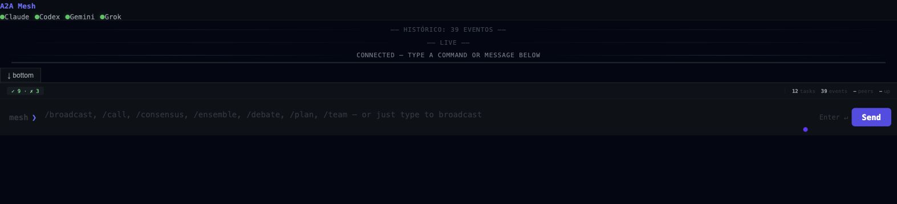

# Guia prático dos comandos multiagente

Este guia mostra qual comando escolher, o que acontece durante a execução e
como formular pedidos que os agentes consigam executar sem adivinhações.



## Comece pela intenção, não pelo nome do comando

Você pode escrever o pedido em linguagem natural. Use `/multiagente` quando
quiser que o roteador escolha a estratégia:

```text
/multiagente Revise esta API. Peça ao Claude para analisar a arquitetura,
ao Codex para testar a implementação e ao Grok para procurar falhas. Use os
arquivos do projeto atual e preserve os dissensos.
```

O roteador mostra a estratégia, os participantes, os limites e o tipo de saída
antes de iniciar. Se você já souber o fluxo desejado, use o comando específico.

| Objetivo | Comando recomendado | O que você recebe |
|---|---|---|
| Consultar um modelo | `/a2a-call` | Uma resposta direta |
| Comparar respostas independentes | `/a2a-broadcast` | Respostas lado a lado |
| Explorar argumentos contrários | `/a2a-debate` | Debate e síntese consultiva |
| Buscar uma posição comum rápida | `/a2a-consensus` | Posições, quórum e dissensos |
| Aprovar um arquivo por hash | `/consenso` | Veredito auditável sobre a versão exata |
| Melhorar um artefato em versões | `/loop-debate-agentes` | Crítica, réplica, revisão e nova versão |
| Produzir parecer, petição ou recurso | `/redacao-juridica-consensual` | Minuta limpa, redline e trilha de revisão |
| Organizar tarefas diferentes | `/workflow-agentes` | Workflow com papéis e handoffs |
| Gerar e revisar código em conjunto | `/a2a-ensemble` ou `/loop-debate-agentes` | Candidatas, revisão cruzada e síntese |

## Como os comandos aparecem em cada CLI

Os exemplos deste guia usam a forma curta, como `/consenso`.

- Em instalações diretas, use `/nome-do-comando`.
- Quando o host exibir o namespace do plugin, use
  `/multiagente-consensual:nome-do-comando`.
- No Kimi Code, a forma explícita é `/skill:nome-do-comando`.
- No painel web A2A, use os comandos curtos próprios do painel, como `/call` e
  `/debate`.

## Comandos do painel A2A

Abra o painel sem copiar o token para o terminal:

```bash
npx @nicholasjacob90/a2a-mesh open
```

Texto sem barra executa um broadcast. Os comandos abaixo controlam o fluxo com
mais precisão.

| Comando no painel | Finalidade | Exemplo |
|---|---|---|
| `/call` | Chama um agente | `/call grok critique esta arquitetura` |
| `/broadcast` | Pergunta a todos em paralelo | `/broadcast liste três riscos desta mudança` |
| `/ask` | Alias de `/broadcast` | `/ask compare REST e GraphQL neste projeto` |
| `/consensus` | Consulta todos e pede síntese ao juiz | `/consensus devemos adotar filas duráveis?` |
| `/debate` | Executa debate adversarial | `/debate --rounds=6 --judge=claude usar monólito ou serviços?` |
| `/ensemble` | Produz código, faz revisão cruzada e sintetiza | `/ensemble --lang=typescript --rounds=3 implemente rate limiting` |
| `/team` | Monta equipe paralela e pede síntese ao juiz | `/team projete e teste uma API de uploads` |
| `/plan` | Alterna autor e revisor sobre um plano | `/plan --rounds=3 --author=claude --reviewer=codex migrar o banco` |
| `/help` | Exibe a ajuda no painel | `/help` |
| `/clear` | Limpa somente a conversa visível | `/clear` |

Use estas opções quando precisar ajustar o painel:

- `--judge=claude|codex|gemini|grok` escolhe o sintetizador.
- `--rounds=N` define o teto do debate, ensemble ou plano.
- `--lang=python|typescript|...` informa a linguagem do ensemble.
- `--order=rotate|fixed` controla a ordem do debate.
- `--author=` e `--reviewer=` definem os papéis do plano.
- `--lenses=engineer,security,ops` define lentes de revisão do plano.
- `--continue` reaproveita o contexto da execução anterior.
- `--reset-session` descarta o contexto continuado.

O painel é uma superfície operacional rápida. `/consensus` no painel continua
consultivo. Para aprovar um arquivo, use `/consenso` e os gates por hash.

## Comandos centrais

### `/multiagente`

Use como entrada universal. O roteador escolhe entre consenso, loop de
melhoria, redação jurídica, workflow ou bridge.

```text
/multiagente Analise a mudança atual do repositório com os modelos disponíveis.
Escolha automaticamente a equipe, mas exija revisão independente antes de
recomendar o merge.
```

### `/consenso`

Use quando a pergunta principal for: “esta versão exata está aprovada?”. O
comando reúne avaliações independentes, aplica o quórum e preserva dissensos.

```text
/consenso Avalie o arquivo docs/arquitetura.md com Claude, Codex e Grok.
Exija quórum de 3, média 8,5, piso 7 por critério e informe todo dissenso
material. Não aprove outra versão do arquivo.
```

Uma síntese favorável não equivale a consenso forte. A aprovação depende do
`veredito_consenso_v1`, dos recibos e do hash do arquivo real.

### `/loop-debate-agentes`

Use quando um agente deve produzir, outro criticar, o autor responder e uma
nova versão ser avaliada. O redator original corrige por padrão; você pode
designar outro consolidador.

```text
/loop-debate-agentes Claude redige a especificação. Codex e Grok criticam,
propõem patches e verificam os testes. Claude responde e publica a próxima
versão. Faça até 4 ciclos completos e 10 versões, parando antes se houver
consenso estável. Preserve os dissensos e somente um artefato canônico.
```

### `/redacao-juridica-consensual`

Use para pareceres, petições, recursos e minutas judiciais. O comando acrescenta
rubrica jurídica, verificação de fontes, revisão cruzada e documentos Word.

```text
/redacao-juridica-consensual Produza um parecer sobre os documentos da pasta
autos. Claude, Codex e Grok devem criar minutas independentes, revisar todas as
candidatas e fazer até 3 ciclos de crítica, réplica e revisão por participante.
Consolide somente uma minuta após consenso e auditoria cega. Entregue a versão
limpa e a versão com alterações do Word.
```

#### Votação global, analítica e híbrida

Em decisões colegiadas, escolha separadamente a forma de publicação e o objeto
do voto. `seriatim`, `per_curiam` e `opinion_of_court` definem a voz da decisão.
`global`, `analitico` e `hibrido` definem como o resultado é apurado.

```text
/consenso Forme uma opinion of the court por votação global case-by-case.
Cada cadeira vota no dispositivo e adere separadamente às proposições.

/consenso Use votação issue-by-issue. Congele as questões e a regra de
derivação antes das cédulas. Mostre maiorias por questão, dispositivo derivado,
resultado por cadeira e eventual maioria cruzada.

/consenso Use método híbrido: questões primeiro e confirmação bloqueante do
dispositivo derivado. Se a confirmação falhar, não proclame o resultado.
```

O método global continua sendo o padrão e usa `decisao_colegiada_v1`. Os modos
analítico e híbrido só são ativados por pedido explícito e usam
`decisao_colegiada_v2`. Nenhuma maioria é convertida em consenso.

### `/workflow-agentes`

Use para combinar papéis e dependências sem exigir debate em todas as etapas.

```text
/workflow-agentes Claude levanta requisitos, Codex implementa, Gemini cria os
testes e Grok executa a revisão adversarial. A etapa seguinte só começa depois
que a anterior produzir uma saída válida.
```

### `/bridge-agentes`

Use para transportar pedidos entre Cowork e as CLIs do Mac. O bridge cuida de
assinatura, fila, timeout, recibos e retomada; ele não decide a estratégia.

## Comandos A2A nas CLIs

Estes comandos usam o MCP local e os agentes `codex`, `claude`, `gemini` e
`grok`. O Grok sempre significa Grok 4.6 High pela rota Cursor.

| Comando | Quando usar | Limite de aprovação |
|---|---|---|
| `/a2a-status` | Conferir portas, modelos e disponibilidade | Nenhum |
| `/a2a-call` | Pedir uma resposta a um agente específico | Nenhum |
| `/a2a-broadcast` | Comparar respostas paralelas sem síntese | Nenhum |
| `/a2a-team` | Distribuir papéis e etapas entre agentes | Nenhum |
| `/a2a-debate` | Fazer debate adversarial com juiz | Consultivo |
| `/a2a-consensus` | Buscar acordo rápido com quórum | Consultivo |
| `/a2a-ensemble` | Gerar código, revisar e sintetizar | Somente candidata |

As seis operações de trabalho acima são submetidas como tarefas duráveis. O comando retorna um ID,
o servidor segue executando e a skill acompanha esse mesmo ID com esperas curtas até o estado
terminal. No MCP, os controles são `a2a_task_status`, `a2a_task_wait` e `a2a_task_cancel`. Não repita
o comando após o fim de uma espera: consulte o ID. O `request_id` impede duplicação acidental.

Essa idempotência fica no SQLite comum aos coordenadores e sobrevive a reinícios. O cancelamento
explícito é encaminhado ao ID remoto já conhecido; uma queda do SSE apenas ativa a consulta da
mesma tarefa. Estados terminais são imutáveis por compare-and-set. Em reconexões muito longas, o
replay é paginado e o painel acusa qualquer lacuna antes de buscar as páginas restantes.

No painel, o texto aparece em tempo real quando a CLI emite deltas; caso contrário, aparecem agente,
fase e estado até a resposta final. A reconexão usa o último ID de evento persistido e recompõe as
lacunas. O painel mostra a saída produzida, não o raciocínio interno privado do modelo. Em falha ou
timeout, procure `partial-output.md` nos artefatos da tarefa.

Cada chamada de modelo usa 30 minutos por padrão. A orquestração completa usa 24 horas por padrão e
aceita `operation_timeout_ms` até 432.000.000 ms (cinco dias). Uma espera MCP individual nunca passa
de 240 segundos; ela pode ser repetida sem interromper ou duplicar a execução.

Exemplos:

```text
/a2a-call grok Procure falhas de segurança no desenho abaixo.

/a2a-broadcast Compare três estratégias de cache para esta API.

/a2a-team codex=tester, claude=arquiteto, gemini=pesquisador,
grok=oponente. Projete uma fila de transcrição resiliente.

/a2a-debate Faça 6 rodadas sobre PostgreSQL versus SQLite neste produto.
Use Grok como oponente e Claude como juiz.

/a2a-consensus Participantes: Claude, Codex e Grok. Quórum: 3.
Devemos promover esta candidata para auditoria formal?

/a2a-ensemble Linguagem TypeScript, participantes Claude, Codex, Gemini e
Grok, juiz Claude, 4 rodadas. Implemente upload retomável.
```

O debate A2A aceita de 1 a 36 rodadas. O ensemble A2A aceita de 1 a 12 ciclos
de revisão. Para documentos, hashes, várias versões e auditoria cega, use o
perfil completo de `/loop-debate-agentes`.

## Protocolos de workflow

Todos estes comandos produzem candidatas. Para aprovação vinculante, encaminhe
o artefato final para `/consenso`.

| Comando | Como trabalha | Exemplo de uso |
|---|---|---|
| `/pipeline-agentes` | Executa A → B → C em sequência | pesquisa → redação → revisão |
| `/dag-agentes` | Executa nós independentes em paralelo e depois faz joins | frontend e API → integração |
| `/swarm-agentes` | Recruta e remove agentes dentro de um pool congelado | investigação ampla e adaptativa |
| `/map-reduce-agentes` | Divide entradas, processa partes e reduz resultados | analisar muitos documentos |
| `/torneio-agentes` | Compara candidatas em confrontos cegos | escolher uma arquitetura |
| `/votacao-agentes` | Agrega preferências por Borda, Condorcet ou Delphi | priorizar alternativas |
| `/roteamento-adaptativo` | Escolhe modelos por qualidade, custo, latência e falha | muitas tarefas heterogêneas |

Exemplo de DAG:

```text
/dag-agentes Crie quatro nós: Claude analisa a arquitetura; Codex verifica o
backend; Gemini verifica o frontend; Grok faz threat modeling. Execute os três
últimos nós em paralelo depois da arquitetura e junte os pareceres em uma
recomendação única. Pause se qualquer nó obrigatório falhar.
```

## Conselhos e debates especializados

Esses comandos apoiam deliberação, mas não aprovam automaticamente um arquivo.

| Comando | Função |
|---|---|
| `/council` | Convoca o Agent Council e registra opiniões independentes |
| `/council-high` | Usa o perfil ampliado do Council of High Intelligence |
| `/llm-council` | Executa conselho adversarial multimodelo |
| `/multi-debate` | Usa exclusivamente o MCP multi-debate |
| `/pal-council` | Usa o MCP pal-council quando autenticado |
| `/sage-debate` | Preserva crítica, réplica, revisão e dissensos |
| `/council-list` | Lista sessões anteriores do council |
| `/council-replay` | Reproduz uma sessão pelo identificador |
| `/council-revisit` | Reavalia uma sessão com fatos novos |
| `/council-outcome` | Registra o resultado observado depois da decisão |

## Rodadas, ciclos e tentativas

Esses controles medem coisas diferentes.

| Controle | Significado | Exemplo |
|---|---|---|
| Rodada | Uma manifestação sobre a mesma versão | crítico apresenta objeções |
| Ciclo completo | Crítica → réplica → revisão | três fases coordenadas |
| Tentativa ou versão | Novo artefato canônico submetido à avaliação | minuta v2 substitui v1 |

Os fluxos completos usam 8 rodadas e 2 ciclos por padrão. Recomendam-se até 18
rodadas e 6 ciclos; o teto excepcional é 36 rodadas e 12 ciclos quando ainda
houver bloqueio material e progresso verificável. Pare após dois ciclos sem
progresso. Cada artefato pode ter de 1 a 20 versões.

## O que significa o limite de aprovação

- **Nenhum:** o comando executa uma operação, mas não declara aprovação.
- **Consultivo:** produz parecer, síntese ou preferência, sem gate vinculante.
- **Somente candidata:** produz ou seleciona uma versão que ainda precisa ser
  aprovada.
- **Configurável:** pode fechar gates somente quando a configuração, os
  recibos e o hash satisfazem o contrato.

Em caso de dúvida, trate qualquer saída como candidata e finalize com
`/consenso` sobre o arquivo real.

## Diagnóstico rápido

```bash
npx @nicholasjacob90/multiagente-consensual status --all
npx @nicholasjacob90/multiagente-consensual doctor --all
npx @nicholasjacob90/a2a-mesh status --json
npx @nicholasjacob90/a2a-mesh doctor
```

Se um modelo estiver indisponível, o sistema informa a redução de quórum ou
pausa conforme a política. Ele não troca silenciosamente o modelo solicitado.
